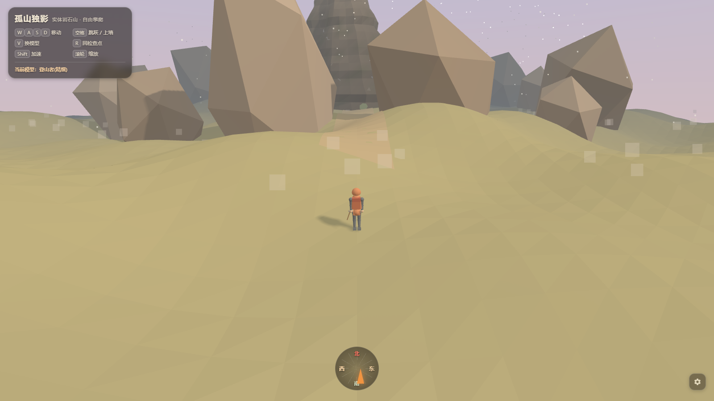

# 用 WorkBuddy 迭代开发《孤山独影》风格 3D 攀岩游戏（hj1→hj45）

> 提交前已搜索社区案例集和蓝皮书目录，未发现 AI 协作单文件 3D 游戏迭代开发类案例。本案例以"开发工作流"为主，非"最终成品展示"。

## 场景描述

一个想做网页 3D 攀岩游戏的独立开发者，受《孤山独影》(Cairn) 风格启发（暖色黄昏、低多边形山岩、平涂阴影、柔雾、第三人称跟随相机），本人不会写代码、完全靠 AI 协作开发。

单纯把 prompt 丢给 AI 让它自由发挥的早期方案有三个典型问题：
1. **AI 输出之间不兼容**——A 任务的输出破坏 B 任务的成果，每次回归都要花大量时间排查
2. **AI 容易"顺手优化"基线代码**——例如方向键事件被悄悄改坏，破坏核心手感
3. **玩法需要重构时**（hj37 时把"绳索+岩钉"系统整体改为"跳跃+抓点攀爬"，hj38 起玩法重构为自由攀爬），模块化不够导致几乎整体推倒重来

## 想要完成的任务

构建一个 Cairn 风格的网页 3D 攀岩游戏，并能在多次 AI 会话、多任务并行下持续演进：
- 单文件 HTML + Three.js（CDN r128），双击即玩
- 跨 45 个版本（hj1→hj45）持续迭代，含一次完整的玩法重构（hj37/hj38 起删绳索改自由攀爬）
- 每次迭代 = 一个新文件，绝不修改基座（版本控制 + 玩法回归双保险）
- 模块化架构、事件总线、调色板注册表——保证多任务产物可拼装
- 最新版 hj45 含完整的毛玻璃 HUD 系统（操作键位卡 + 状态条 + 罗盘 + 装备栏 + 设置面板）
- 每个任务交付三件套：模块代码 + 集成说明 + 自检清单

## 使用的 Skill

| Skill | 用途 | 来源或安装方式 |
| --- | --- | --- |
| 项目级技能 `hj-game-dev` | 加载项目宪法（任务分解与契约、操作与验收手册、红牌规则、模块契约、任务 DAG），会话级自动触发 | 项目内 `.agents/skills/hj-game-dev/SKILL.md` |
| CodeBuddy 编程协作 | 与 AI 对话生成 Three.js 游戏代码，红牌规则由项目级技能自动注入 | WorkBuddy 内置编程协作模式 |
| 浏览器预览 | 双击 HTML 即可玩，无需构建/服务器；WorkBuddy 内也可触发浏览器自动化做回归/截图 | WorkBuddy 内置 |

## 前置条件

- WorkBuddy 版本：支持项目级技能的版本（≥2025）
- 操作系统：Windows / macOS / Linux 均可（HTML 文件跨平台）
- 所需账号或权限：无外部账号，纯本地浏览器运行
- 所需输入文件：基座 HTML（`<your-baseline>.html`，游戏的上一版可玩文件）—— 必须存在才能做下一版迭代

## 在 WorkBuddy 中的操作

1. **先写"任务分解与契约"宪法**（一次性投入约 1 天）：把地基（坐标系 / 单位 / 主循环 / 模块接口）、契约（state 字段表 / 事件名注册表）、任务 DAG 提前定死，作为后续所有任务的"宪法"。
2. **立基座**：`<your-baseline>.html` → ... → `<your-stable-base>.html`，把地基模块化（F0）和最小可玩性跑通。
3. **每次迭代 = 新文件 `hjN+1(方向).html`**：括号写本次方向（如"攀爬修正""美术收点""UI优化""隐藏攀爬点"），绝不修改基座文件——这是版本控制 + 玩法回归双保险。
4. **模块用 `//== MODULE: xxx ==` 注释段包裹**：集成时只替换该段代码，不动其他模块。
5. **任务分发前粘贴"§0 必读契约段"**：每个子任务的 prompt 开头都强制粘贴契约约束，让 AI 在写代码前必读宪法。
6. **验收回归**：先 headless 跑 `node -e "new Function(scriptText)"` 语法校验零错误；再手动双击 HTML 跑回归——WASD 移动 / 滚轮缩放 / 右键拖俯仰 / 按 E 交互 / 按 V 换装（按当前基座玩法）。
7. **若涉及玩法重构**：先新增"模块段"再下线旧模块（hj37/hj38 玩法重构时，先注册新攀爬模块，再下线绳索模块，未影响其他模块）。
8. **UI 优化走"独立 CSS 变量层"**：hj45 把 UI 拆成独立 `:root` CSS 变量（颜色、圆角、阴影、毛玻璃模糊），与游戏 3D 场景渲染解耦，便于按方向独立迭代。

## 提示词或任务指令

```text
任务：基于 <your-baseline>.html 实现【{方向}】模块。

§0 必读契约（动手前先执行）
1. Read `<your-project>/hj-任务分解与契约.md`，完整读完再写代码。
2. 模块必须实现 {name, init, update, dispose}，通过 Game.register 接入。
3. 只读写契约"state 字段表"列明的字段；跨模块通信只走 events 总线，
   事件名从"事件名注册表"取（新增先入表）。
4. 颜色只走 PALETTE 注册表，禁止硬编码。
5. 交付附：①模块代码 ②集成说明（订阅/派发哪些事件、读写 state 哪些字段）
   ③兼容自检清单。
未满足以上任一条，视为不兼容，不予合并。

输出：新文件 `hj{N+1}({方向}).html`，不要修改 <your-baseline>.html。
```

> 提示词已脱敏（去掉了具体路径与编号）。其他用户在自己的游戏项目里可改 `<your-project>`、`<your-baseline>` 复用。

## 在 WorkBuddy 中的效果

最终产出：可玩的网页 3D 攀岩游戏，覆盖 45 个迭代版本（hj1→hj45），含一次完整玩法重构（hj37/hj38 起把绳索系统改为跳跃+抓点自由攀爬），最新版 hj45 含完整毛玻璃 HUD 系统（操作键位卡、状态条、罗盘、装备栏、设置按钮）。



> 截图说明：hj45(UI优化).html 初始画面。毛玻璃 HUD（左上：标题 + 操作键位 + 状态条）、罗盘（底部居中：东南西北 + 朝向指针）、角色 + 低多边形山岩黄昏场景。风格统一（暖色黄昏柔雾低多边形山岩）贯穿所有版本，是地基 + 美术收点 + UI 优化迭代的成果。

## 验收标准

- **双击即玩**：每个迭代文件用浏览器打开即可玩，无需任何构建 / 服务器
- **基座不破坏**：基座文件自交付以来未被修改过，每次只在最新文件上迭代
- **模块契约遵守**：每个新增模块实现 `{name, init, update, dispose}`，事件名全部在注册表内
- **状态契约遵守**：模块只读写 state 字段表列明的字段（READ / WRITE 已声明）
- **调色板遵守**：所有颜色从 `ctx.palette` 取，零硬编码色值
- **语法校验通过**：`node -e "new Function(scriptText)"` 零错误
- **回归测试通过**：手动打开，新功能不破坏基座玩法（移动 / 相机 / 攀爬 / 换装）
- **三件套交付齐全**：模块代码 + 集成说明 + 自检清单齐备

## 遇到的问题

- **AI 容易"顺手优化"基线**：方向键事件在迭代时 AI 试图优化手感、破坏基线；后来在"红牌规则"里加明文"方向键基线 = hj{N}，勿'顺手优化'"才止住
- **模块间通信耦合**：早期模块直接改他人对象，回归时定位 bug 极困难；后来强制走 `events` 总线 + 事件名注册表
- **玩法重构代价**：hj37/hj38 时绳索系统整体弃用改自由攀爬，因有"模块段替换"机制，未影响其他模块——这是契约化架构的红利
- **文档先行 vs 任务先行**：第一次写契约花了 1 整天，但回报是后续 45+ 任务几乎零兼容性冲突
- **UI 与渲染耦合**：hj45 前 UI 直接混在游戏渲染里，迭代时频繁冲突；后来把 UI 拆成独立 CSS 变量层 + 独立 HTML 节点，与 Three.js 场景完全解耦

## 安全与限制

- **纯前端项目**：无后端、无外部数据、无 API Key——唯一对外依赖是 Three.js（已离线内联到后期版本，离线可玩）
- **不引入外部模型 / 图片**：所有美术资源程序化生成（噪声地形 + 低多边形几何），避免版权问题
- **不涉及账号授权、对外发布、用户数据**：本案例是开发工作流，不直接面对最终用户
- **体积限制**：单 HTML 文件保持 <1 MB，便于分享和归档
- **不存储敏感数据**：存档键仅存本地游戏设置，无个人信息

## 可以怎样复用

- **单文件 HTML + Three.js 游戏框架的契约化开发模式**：地基（F0）+ 契约 + 事件注册表这套设计可直接平移到任何 JS/TS 模块化项目
- **"每次迭代新文件"的版本控制思路**：对 AI 协作编程特别有效——基座不破坏 = 永远可回归 + 永远可比较新方向
- **`//== MODULE: xxx ==` 注释段包裹**：让"按段替换"成为 AI 协作的物理边界
- **"§0 必读契约段"作为每个子任务的 prompt 前缀**：把契约约束从"靠人记"变成"靠 prompt 强制"
- **三件套交付（代码 + 集成说明 + 自检清单）**：让多个 AI 会话/任务的产物可拼装
- **UI 与渲染解耦**：CSS 变量层 + 独立 HTML 节点，让 UI 优化走独立迭代节奏，不破坏游戏手感
- **未来平移到 Godot 4**：地基 F0 是设计契约，与引擎无关；将来换引擎时由主控用 GDScript 重做一遍节点树 + 信号总线 + 同款 state 字段