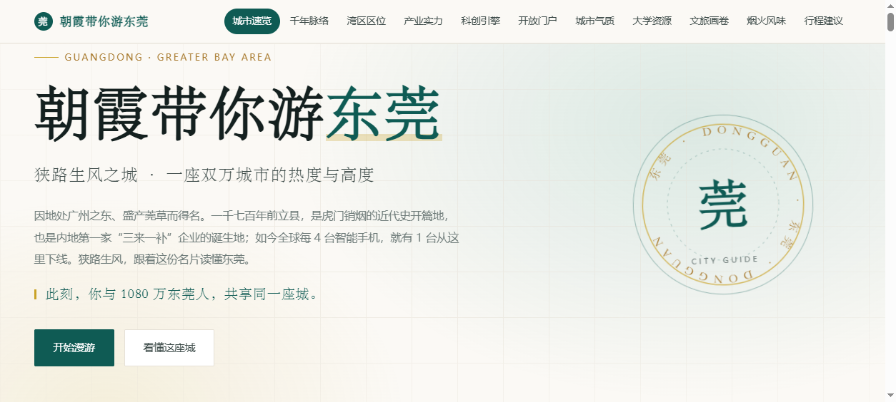
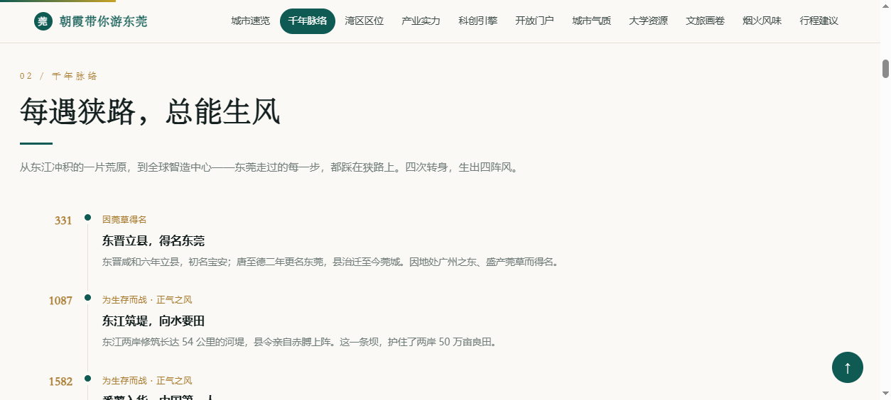
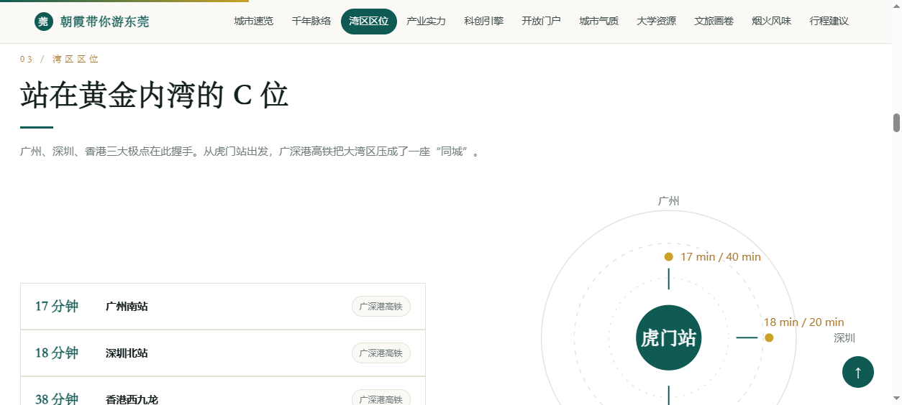

# 朝霞带你游东莞：一句话生成一座城市的数据驱动名片

> 本案例演示：如何用「网站设计」能力，把一座城市的官方资料整理成一份可交互、可换城市的单文件 HTML 城市名片。成品为「朝霞带你游东莞」，页面结构完全由数据驱动，换任何城市只需替换一个数据对象。

## 场景描述

做城市推介材料，通常卡在两难：做成 PPT，数据堆叠、翻页即逝；写成公众号长文，好看但拿不出手、也不好改。市面上的旅游攻略模板又大多只有"去哪玩、吃什么"，撑不起招商、接待、对外宣传的场合。

一位在政府办公室工作的用户，需要一份既能讲清城市实力（GDP、外贸、产业集群、大科学装置）、又能带人逛街巷（景点、美食、行程）的城市名片，且希望它能被复用到其他城市、其他场合。

## 想要完成的任务

- **输入**：一座城市的名称，以及它的官方资料（统计公报、政府门户介绍、文旅信息等）。
- **目标**：一份单文件 HTML，零外部依赖，双击即开、可直接分享。
- **预期交付物**：包含 11 个板块的可交互网页，页面文字与数据全部由页面内的一个 `CITY` 常量对象驱动渲染。

## 使用的 Skill

| Skill | 用途 | 来源或安装方式 |
| ----- | ----- | ----- |
| 网站设计 | 生成单文件 HTML 网页，承载全部板块与动效 | WorkBuddy 内置（设计创意模式 → 网站设计） |

## 前置条件

- WorkBuddy 版本：5.x（需进入「设计创意」模式）
- 操作系统：Windows 10/11
- 所需账号或权限：无
- 所需输入文件：无硬性要求；建议准备该城市的官方统计公报、政府门户「走进 X 城」介绍、文旅信息，用于核对数据

## 在 WorkBuddy 中的操作

1. 在对话框上方切换到「设计创意」模式，选择「网站设计」。
2. 输入下方「提示词或任务指令」，把 `{{城市}}` 换成目标城市名。
3. 发送后，WorkBuddy 生成单文件 HTML，右侧内置浏览器自动打开预览。
4. 从首屏开始逐板块检查：数字是否正常滚动、时间轴是否完整、数据是否与官方口径一致。
5. 核对无误后，将 HTML 保存到本地（可直接双击打开或分享）。

## 提示词或任务指令

~~~text
帮我做一份「{{城市}}」的城市名片交互式网页，输出单文件 HTML，无任何外部依赖。

【一、页面结构】按顺序生成 11 个板块：
1. 城市速览——8 张数据卡，覆盖行政区划、人口规模与结构、三次产业结构、人均 GDP、市场主体、创新主体、城市荣誉等基本面
2. 千年脉络——垂直时间轴，用 8-11 个关键年份串起城市发展史，提炼一条贯穿全篇的叙事主线
3. 区位交通——SVG 同心圆"时空圈"，中心放该市主枢纽，四方标注到周边核心城市/机场的通勤分钟数
4. 产业实力——产业集群卡片（用"全球每 X 台就有一台产自这里"等独家比例数据）+ 增速条形图 + 高增长产品标签
5. 科创引擎——深绿渐变卡片，突出大科学装置、重点实验室、科学城数据
6. 开放门户——5 项外贸外资核心数据
7. 城市气质——6 张带线性图标的气质卡，亮出该市独有城市名号
8. 大学资源——列出该市高校（校名 + 层次标签 + 一句话介绍）
9. 文旅画卷——4 个分区 Tab 切换（老城人文 / 历史史迹 / 湖山生态 / 潮流文创），每区 4-6 个景点卡片
10. 烟火风味——8-10 道地道美食，按区县标注
11. 行程建议——1 日 / 2 日 / 3 日三条路线

【二、内容要求】
- 全部数据使用官方公开口径，页脚标注来源
- 页脚加一句提示：票价、开放时间等信息可能变动，出行前请核实官方渠道
- 语言风格：稳重、克制、有文化质感，避免营销腔
- 景点按片区归类，行程不要走回头路

【三、技术要求】
- 单文件 HTML，CSS 与 JS 全内联，不引用任何 CDN、字体或外部图片
- 全站内容由一个名为 CITY 的 JavaScript 常量对象驱动渲染，换城市只需替换该对象
- 必须包含：顶部滚动进度条、区块滚动渐入、数字滚动计数、条形图进入视口自动生长、导航自动高亮、回到顶部按钮
- 响应式：桌面多列网格、手机单列、导航横向滚动

【四、交付】
输出一个 .html 文件，命名为「朝霞带你游{{城市}}.html」，并打开预览确认效果。
~~~

## 在 WorkBuddy 中的效果

成品为「朝霞带你游东莞」，约 46 KB，零外部依赖。11 个板块从城市速览、千年脉络、湾区区位，一路走到城市气质、大学资源、文旅画卷与行程建议。

- **首屏**：衬线大标题 + 旋转徽标 + 四组核心数据（GDP、人口、外贸、平均年龄）滚动计数 + 一句欢迎语
- **千年脉络**：11 个时间节点的垂直时间轴，用"每遇狭路总能生风"串联发展史
- **湾区区位**：SVG 同心圆时空圈，中心为虎门站，四方标注到广州、深圳、香港、机场的分钟数
- **城市气质**：藏茶之都、篮球之城、潮玩之都等 6 张带线性图标的气质卡
- **大学资源**：10 所高校卡片

## 验收标准

- 页面是**单文件 HTML**，无任何外部资源引用（可离线双击打开）。
- 11 个板块齐全，导航可跳转、自动高亮。
- **首屏四组核心数据能正常滚动显示真实数值**（不卡在 0）。
- 换城市时，只需替换 `CITY` 对象，页面结构与动效无需改动。
- 页脚标注数据来源，并提示票价、开放时间可能变动。
- 所有数据可回溯到官方公开口径，重要数字需人工复查。

## 遇到的问题

1. **首屏数据数字显示为 0**：数字滚动动画初始绑定在下方板块上，首屏数据条不在动画触发范围内，导致数字停在初始值 0。解决：对首屏数据条单独触发一次计数动画。
2. **斑马纹底色上白卡片"糊"成一片**：交替区块（白底）里的白色卡片缺少对比。解决：为斑马纹区块内的卡片单独反色（白卡片换暖白底）。
3. **打印时区块整体空白**：区块初始 `opacity:0`，打印时不会触发渐入。解决：在 `@media print` 中强制 `opacity:1`。
4. **老版 WPS 资料无法直接读取**：`.wps` 为 OLE2 二进制格式。解决：本机用 Microsoft Word 的 COM 接口打开并导出为文本后再整理。

## 安全与限制

- **数据必须人工复核**：GDP、人口、外贸、高校名单等数字应以官方统计公报、政府门户为准；AI 可能张冠李戴，涉及对外发布前务必逐项核对。
- **景点票价与开放时间会变动**：页面仅作展示参考，页脚已提示出行前核实官方渠道。
- **肖像权**：投稿/公开展示的版本不放个人照片，避免他人"做同款"后复用肖像；如做个人 IP 版，请自行确认肖像使用授权。
- **不收集数据、不调用权限**：页面为纯静态 HTML，无后端、无统计、无外部请求。

## 可以怎样复用

- **换城市**：只改 `CITY` 对象（城市名、徽标字、核心数据、时间轴、产业集群、交通时空圈、文旅分区、美食、高校、行程），11 个板块与全部动效自动适配。
- **换用途**：删掉「千年脉络」或「行程建议」等板块，改成企业介绍页、产品发布会长页、活动宣传页。
- **做同款**：把本案例的提示词中的 `{{城市}}` 换成目标城市，即可一键生成对应版本。
- **配自动化**：可进一步配置定时任务，让核心数据定期更新，形成城市信息的自动维护页。

