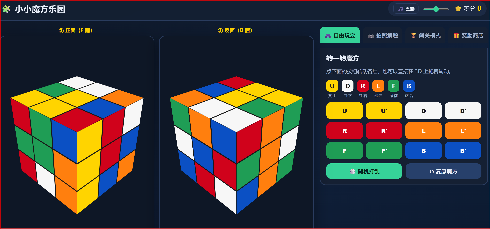
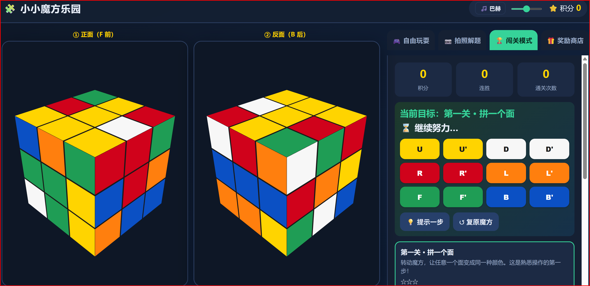
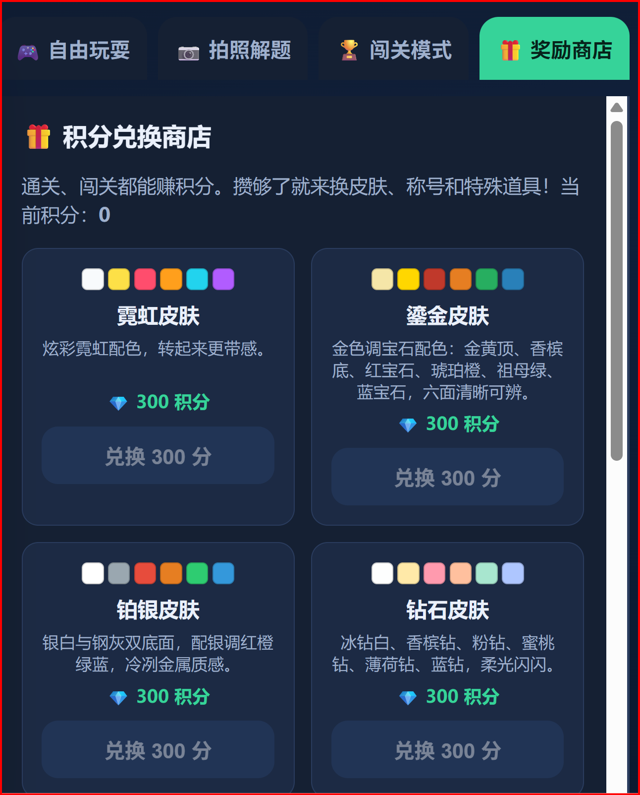
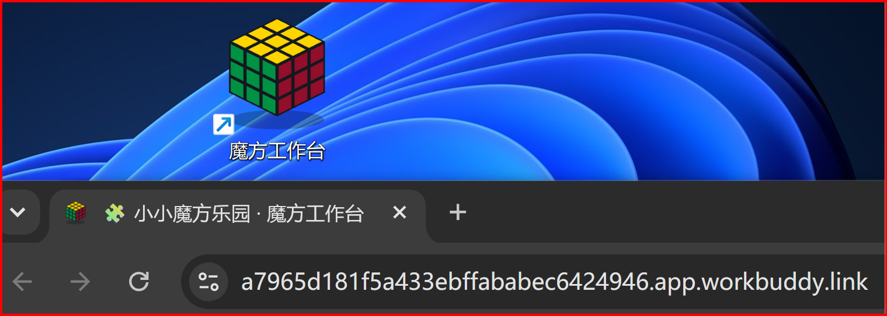

# 用 WorkBuddy 给孩子搭一个 3D 魔方工作台

> 提交前已搜索社区案例集与蓝皮书：现有 submissions（annual-report-digital-transformation、daily-ai-news、jz-2025-showreel、tea-shop-sales-analysis、vibe-resume、wechat-format-publish、wechat-ima-knowledge）与 `docs/bluebook` 均无魔方 / 3D 互动玩具相关案例，无重复。

## 场景描述

孩子在学三阶魔方「层先法」。市面上的魔方 App 要么塞满广告，要么解题要付费，要么界面太花不适合低龄。我想要一个**自己能改、孩子能玩**的版本：能转、能看解法、有闯关激励、还能装到桌面当小玩具。作为非前端出身，从零写 3D + 求解器不现实，但在 WorkBuddy 里全程对话式搭建是可行的。

## 想要完成的任务

- 一个网页版 3D 三阶魔方：可拖拽转动单层、可旋转视角。
- 三个玩法：自由玩耍、拍照解题（输入六面状态给出还原步骤）、闯关模式。
- 闯关有积分、星级、连胜，加一个积分兑换商店（皮肤 / 称号 / 道具）。
- 一键部署成公网可访问链接，并生成桌面快捷方式 + 图标。
- 最终交付：一个可分享的公网页面 + 本地可跑的源码。

## 使用的 Skill

| Skill | 用途 | 来源或安装方式 |
| --- | --- | --- |
| cloudstudio-deploy | 把构建好的静态站发布为公网可访问链接 | WorkBuddy 内置 |

## 前置条件

- WorkBuddy 版本：含 cloudstudio-deploy 内置 Skill 的版本
- 操作系统：Windows（也适用于 macOS / Linux）
- 所需账号或权限：无需额外账号，部署由 WorkBuddy 内置 CloudStudio 完成
- 所需输入文件：无，全部从零生成

## 在 WorkBuddy 中的操作

1. **搭 3D 魔方**：用 three.js 做一个等距三阶魔方，支持拖拽转动单层、空白处旋转视角；UDRLFB 六面用标准配色（上黄 / 下白 / 右红 / 左橙 / 前绿 / 后蓝），转动按钮也按面着色。
2. **接拍照解题**：做手动涂色面板（六面 54 格取色），再实现「层先法」求解器（cross / corner / mid / ll 四张 BFS 表），输入状态后输出分步解法并在 3D 上逐步播放。
3. **加闯关模式**：5 关递进（拼一面 → 底层十字 → 完整底层 → 前两层 → 整体还原），通关给积分与星级，记录连胜与通关次数；面板内放彩色转动按钮，并加「提示一步」。
4. **加奖励商店**：积分可兑换皮肤（霓虹 / 鎏金 / 铂银 / 钻石 / 亮晶晶 / 彩粉）、称号、双倍积分卡、黄金彩带庆祝；正反双视图同步换肤与动画。
5. **加背景音乐与桌面入口**：接一段循环背景音乐；生成等距魔方图标（.ico）并在桌面放指向公网链接的快捷方式。
6. **部署公网**：用 cloudstudio-deploy 一键发布，得到可分享的公网链接。

## 提示词或任务指令

```text
帮我做一个三阶魔方工作台：
1) 3D 魔方可拖拽转动单层、可旋转视角，UDRLFB 按标准配色；
2) 自由玩耍 + 拍照解题（手动涂色 + 层先法求解器，输出分步解法并在 3D 上播放）；
3) 闯关模式：5 关递进，通关给积分和星级，面板内要有彩色转动按钮；
4) 积分兑换商店：皮肤 / 称号 / 双倍积分卡 / 庆祝特效，正反双视图同步；
5) 背景音乐 + 桌面快捷方式 + 图标；
6) 用 cloudstudio-deploy 部署成公网可访问的版本。
```

## 在 WorkBuddy 中的效果

最终产出一个单文件静态站，公网可访问，包含自由玩耍、拍照解题、闯关模式、奖励商店四个标签页，并配有背景音乐与桌面快捷方式。

封面图标（等距 3D 魔方）：


自由玩耍：3D 魔方 + 彩色 UDRLFB 转动按钮 + 双视图：



闯关模式：彩色转动按钮、目标状态实时检测、过关庆祝：



奖励商店：多套皮肤兑换，正反视图同步换色：



公网部署与桌面快捷方式：



## 验收标准

- 公网链接可打开，3D 魔方可拖拽转动单层、可旋转视角。
- 拍照解题：手动涂色后能输出还原步骤并在 3D 上逐步播放。
- 闯关：转到目标状态（不要求逆推打乱）即判定过关、加分、解锁下一关。
- 奖励商店：积分足够时可兑换皮肤 / 称号 / 道具并即时生效。
- 背景音乐可开关、可调音量；桌面快捷方式双击直达公网链接。
- 链接：部署后由 cloudstudio-deploy 返回，可在「设置 - 数据管理 - 我发布的应用」中管理。

## 遇到的问题

- **闯关不过关**：曾出现「拼成了但不判定过关」。根因是动画完成回调里没有触发外部 `onMoveDone` 钩子，导致计步与目标检测从未执行；在动画 onDone 里补回该回调后恢复。检测本就按目标状态判（任一面同色 / 白十字 / 底层 / 前两层 / 整体还原），不要求逆推打乱路径。
- **桌面快捷方式**：Windows `.lnk` 走 COM，沙箱禁用；改用 `.url`（InternetShortcut）+ 自定义 `.ico`，绕过 COM。
- **图标生成**：pip 安装 Pillow 被沙箱网络拦截；改用 Node 内置 zlib 手写 PNG 编码 + 多尺寸 ICO，零第三方依赖。
- **皮肤配色**：早期「马卡龙」配色六色太接近、难区分；换成霓虹 / 鎏金 / 铂银 / 钻石 / 亮晶晶 / 彩粉等高区分度配色，并对已购旧皮肤做自动迁移。

## 安全与限制

- 公网页面**公开可访问**：不要在站点里放任何私人或企业数据。
- 背景音乐使用了第三方演奏录音，个人使用尚可；若要正式公开发布或商业化，需替换为公共领域 / CC0 录音或合成音乐。
- 部署产物可在「设置 - 数据管理 - 我发布的应用」中删除或重新发布。
- 求解器的 BFS 表体积较大（紧凑后约 31MB），首次加载需等表下载完成。

## 可以怎样复用

- **其他桌面小玩具 / 教育工具**：同一套「three.js 3D + 闯关积分 + cloudstudio-deploy 公网发布」可直接迁移，例如围棋启蒙小屋、数独、华容道。
- **求解器单独抽能力**：把「层先法求解器」从项目中剥离，包成 Skill（输入六面状态 → 输出还原步骤），可作为 Agent 可调用的能力。
- **图标与快捷方式套路**：Node 手写 PNG/ICO + `.url` 桌面入口的组合，适用于任何需要本地桌面入口的 Web 应用。
