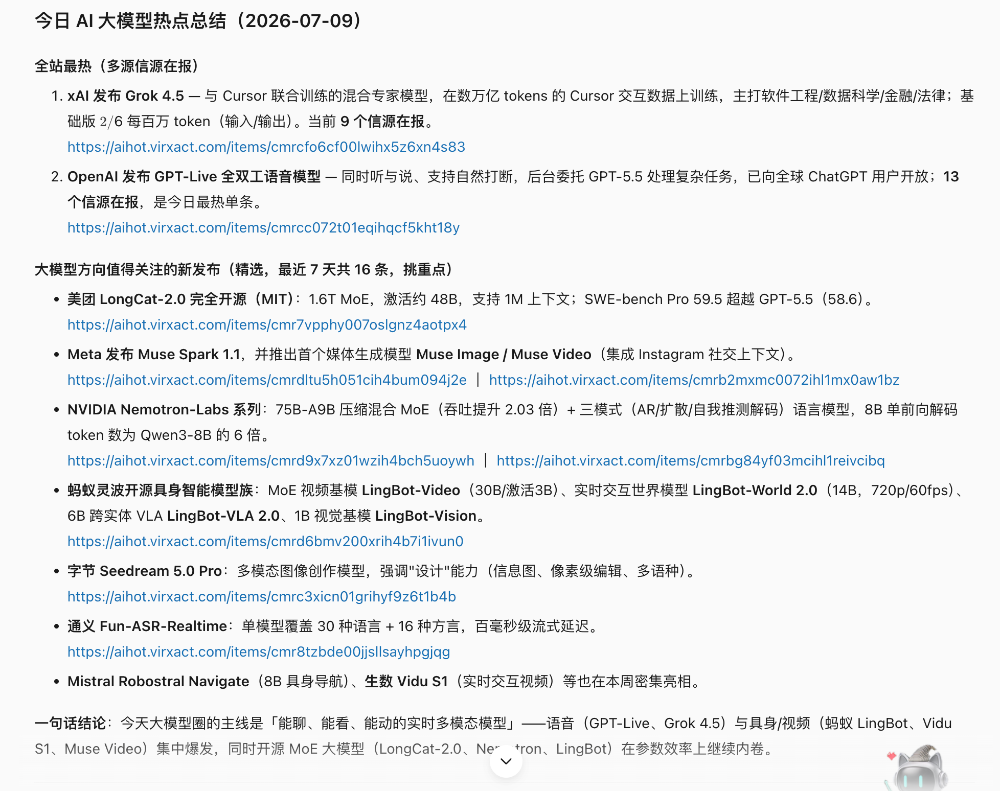

# 【示例】用 WorkBuddy 自动整理每日 AI 资讯

## 场景描述

AI 资讯更新很快，同一事件经常出现在多个媒体和信息源中。逐个网站浏览不仅耗时，也容易错过模型发布、产品更新、开源项目和行业变化。

这个案例适合需要持续关注 AI 行业的产品、研发、运营、投资和内容团队。我们希望把“到处找新闻”变成一次可以重复执行的 WorkBuddy 任务。

## 想要完成的任务

完成后，WorkBuddy 应当能够：

1. 查询指定时间范围内的 AI 行业动态。
2. 按公司、模型、产品或主题筛选内容。
3. 为每条信息保留标题、摘要、发布时间和来源链接。
4. 把大量候选信息整理成更容易阅读的热点报告。
5. 根据任务要求重点关注大模型、产品、开源项目或论文等方向。

## AIHot Skill 能做什么

AIHot 是面向 AI 动态的信息类 Skill，适合查询和整理模型、产品、行业、论文与开源项目等方向的近期内容。它可以作为 WorkBuddy 的现成信息源，根据你的任务描述返回相关资讯和原始链接。

| 用法 | 任务示例 | 适合谁 |
| --- | --- | --- |
| 公司动态追踪 | 最近 7 天 OpenAI 发布了什么 | 产品、研发、投资 |
| 每日热点整理 | 总结今日 AI 大模型热点 | AI 团队、内容团队 |
| 专题检索 | 查找最近一周多模态模型相关动态 | 研究、产品规划 |
| 来源补充 | 给每条结论保留原始报道链接 | 需要进一步核查的读者 |

AIHot 负责提供和检索候选资讯；哪些内容值得重点关注、怎样分类和以什么格式输出，由你写给 WorkBuddy 的任务描述决定。

## 安装前准备

- 已经可以正常使用 WorkBuddy。
- WorkBuddy 可以访问外部网页。
- AIHot Skill 地址：`https://aihot.virxact.com/aihot-skill/`

AIHot 来自外部地址。安装前应查看来源域名和 Skill 内容，并让 WorkBuddy 先执行安全检查。不要安装来源不明、要求异常权限或包含可疑脚本的 Skill。

## 在 WorkBuddy 中安装 AIHot Skill

打开一个新的 WorkBuddy 任务，直接输入：

```text
帮我安装这个 skill：https://aihot.virxact.com/aihot-skill/
```

WorkBuddy 会先获取 Skill 内容，并调用 Skill 安全检查流程。确认来源、权限和将要执行的内容没有异常后，再继续安装。


安装完成后，可以继续问：

```text
请告诉我 AIHot Skill 已经安装到哪里、它能完成哪些任务，以及调用时是否需要额外账号或权限。
```

这一步可以帮助你确认 Skill 是否真的可用，而不是只看到安装任务结束。

## 任务一：查询最近 OpenAI 动态

最简单的任务描述是：

```text
请看一下最近 OpenAI 发布了什么新东西。
```

为了让结果更稳定、方便核查，推荐写得更明确：

```text
使用 AIHot Skill 查询最近 7 天与 OpenAI 相关的动态。

要求：
1. 优先整理 OpenAI 官方发布、模型与产品更新、API 变化和重要行业动态；
2. 合并明显重复的同一事件；
3. 每条内容包含标题、发布时间、两句话摘要和原始来源链接；
4. 按“官方动态、产品与模型、行业影响”分类；
5. 不确定的信息请明确标记，不要补写没有来源支持的结论。
```

实际运行后，WorkBuddy 返回了最近 7 天的 OpenAI 相关内容，并为每条资讯保留标题、时间、摘要和 AIHot 原始链接：


## 任务二：生成今日 AI 大模型热点总结

如果希望得到一份更接近日报的结果，可以输入：

```text
使用 AIHot Skill 总结今天的 AI 热点新闻，重点关注 AI 大模型方向。

请按下面结构输出：
1. 今日最热：列出最值得关注的 3 条动态；
2. 大模型新发布：整理最近 7 天值得关注的模型、产品和开源项目；
3. 每条包含一句话摘要、为什么值得关注和来源链接；
4. 合并重复报道，并注明有多少个信息源在报道同一事件；
5. 最后用一句话总结今天的大模型行业主线。
```

实际结果按照热点和大模型方向进行了整理，保留了具体来源链接，并给出一句话结论：



## 怎样把任务描述写得更好

一个稳定的 AIHot 任务描述，至少应该明确四件事：

| 要素 | 写法示例 |
| --- | --- |
| 时间范围 | 今天、最近 24 小时、最近 7 天 |
| 关注主题 | OpenAI、大模型、多模态、AI Agent、开源项目 |
| 筛选标准 | 只保留重要更新、合并重复事件、优先官方来源 |
| 输出格式 | 标题、摘要、时间、影响判断、来源链接 |

如果只说“总结 AI 新闻”，WorkBuddy 仍然可以执行，但结果的数量、范围和格式不够稳定。任务描述越明确，输出越容易复用和验收。

## 最终效果

通过 AIHot Skill，WorkBuddy 把分散的 AI 资讯整理成了两类可以直接阅读的结果：

- 围绕特定公司或主题的近期动态列表。
- 经过筛选、分类和去重的 AI 热点总结。

每条信息都保留来源链接，读者可以继续打开原文核查，而不是只依赖模型生成的摘要。

## 验收标准

- AIHot Skill 已成功安装，并能在新任务中被调用。
- 查询结果符合任务指定的时间范围和主题。
- 每条重要资讯都保留了可以继续访问的来源链接。
- 相同事件不会被当作多条重点新闻重复呈现。
- 摘要没有加入来源无法支持的数字和结论。
- 热点报告的分类与任务描述一致。

## 常见问题

### 安装后没有调用 AIHot

在任务中明确写出“使用 AIHot Skill”，并让 WorkBuddy 说明它实际调用了哪个 Skill。如果仍然不可用，检查 Skill 是否安装成功以及当前工作区是否能看到它。

### 返回的信息太多

缩短时间范围，限定公司或主题，并明确只保留 5～8 条最重要内容。

### 结果看起来像普通摘要

要求保留发布时间、来源名称和原始链接，并明确写出分类、去重和影响判断规则。

## 安全与限制

- AIHot 是资讯来源，不代表所有内容都已经完成事实核查。
- 对重要结论，应继续打开原始链接，优先核对官方来源。
- 新闻内容会随时间变化，相同任务在不同日期得到的结果也会不同。
- 安装外部 Skill 前应检查来源、权限和脚本内容。
- 不要把未经核实的热点摘要直接用于正式对外发布。

## 可以怎样复用

把任务中的主题替换掉，就可以快速得到不同方向的资讯报告，例如：

```text
使用 AIHot Skill 查询最近 7 天 AI Agent 相关动态，重点关注新产品、开源框架和企业落地案例。每条保留来源链接，最后总结 3 个值得团队继续研究的方向。
```

也可以在确认单次任务稳定后，再结合 WorkBuddy 自动化任务，把相同提示词设置为每日或每周重复执行。自动化属于后续扩展，这个 Case 首先确保 AIHot 的安装、调用和输出可以独立跑通。
