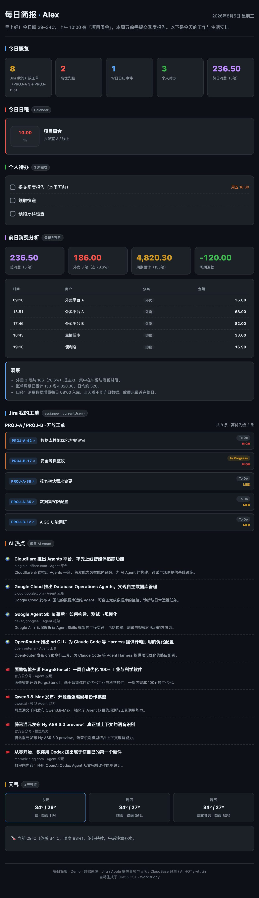

# 用 WorkBuddy 自动生成并推送每日简报

> 一个面向「打工人」的端到端自动化案例：把分散在 Jira、Apple 生态、消费账单和互联网上的信息聚合到一张早安简报，每天 07:00 自动生成 HTML 页面并邮件推送。

## 场景描述

日常工作中需要在多个系统之间反复切换：

- **Jira** 里有分配给自己的待办工单，每天手动刷新才知道今天要做什么。
- **Apple 提醒事项与日历** 是个人待办和生活日程的主入口，但和 Jira 工单没有统一视图。
- **信用卡账单**（增量每日入库到 MySQL）需要主动去数据库查才知道昨天花了什么。
- **AI 资讯** 每天从十几个来源分散出现，需要人工筛选才能找到和自己工作相关的内容。
- **天气** 决定穿衣和是否带伞。

原来的做法是每天早上花 15-20 分钟手动汇总：开 Jira 看工单、开日历看日程、查数据库看消费、刷 X/公众号看 AI 新闻、看天气 App。最后还要把汇总信息发到自己的邮箱或者钉一下自己。

这套流程有两个问题：**费时**和**不一致**——某天忘了查某个数据源，那天的简报就缺一块；AI 资讯每次看的来源都不一样，质量参差不齐。

## 想要完成的任务

构建一个 **全自动运行的「每日简报」系统**，每天早上定时执行以下流程：

1. 从 6 个数据源并行采集当日相关信息
2. 生成一张单页 HTML（暗色金融风、手机友好、零外部依赖）
3. 部署到公网拿到分享链接
4. 生成对应的邮件正文 HTML 并发送到指定邮箱
5. 输出结构化摘要到对话

预期交付物：
- 一份包含 6 个模块的 HTML 简报（概览统计 / 日程 / 待办 / 消费 / Jira / AI 热点 / 天气）
- 一封包含简报摘要和完整链接的邮件
- 一个可分享的公网链接

## 使用的 Skill

| Skill | 用途 | 来源或安装方式 |
| --- | --- | --- |
| Jira MCP | 查询分配给当前用户的开放工单（key/标题/状态/优先级/browse_url） | 连接器市场内置 |
| CloudBase MCP | 查询 MySQL 中的信用卡账单流水（最新完整日明细 + 周期累计） | 连接器市场内置 |
| AI HOT | 拉取过去 7 天精选 AI 资讯，支持按关键词筛选 | 用户级 Skill，需安装 |
| Apple Reminders & Calendar | 读取个人待办（Groceries 列表）和当日日程（Calendar） | 系统命令 `osascript`，需要 AE 桥接 |
| CloudStudio 部署 | 将生成的静态 HTML 部署到公网，拿到访问链接 | 连接器市场内置 |
| 网易邮箱 SMTP | 发送 HTML 格式的简报到指定邮箱 | 连接器市场内置 |
| wttr.in | 拉取当前天气和未来 3 天预报 | 公开 HTTP 接口，无需密钥 |

## 前置条件

- **WorkBuddy 版本**：支持定时自动化（`automation_update`）+ MCP 连接器
- **操作系统**：macOS（AppleScript + Reminders/Calendar 集成依赖）
- **所需账号或权限**：
  - Atlassian Jira 账号（个人 API Token 或 OAuth）
  - 腾讯云 CloudBase 环境（用于账单数据库）
  - 网易邮箱 SMTP 授权码
  - （可选）WorkBuddy 与 macOS 系统的 Apple Events 授权
- **所需输入文件**：
  - 个人 Reminders 中名为 `Groceries` 的列表（统一收纳待办）
  - Calendar 中名为「日历」/「Calendar」的默认账号
  - CloudBase MySQL 中的账单表 `bill_transaction`（字段：`bill_date`, `txn_time`, `merchant`, `category`, `amount_cny`, `card_no`）

## 在 WorkBuddy 中的操作

1. **创建定时自动化**：调用 `automation_update`（mode=create）注册一个名为「每日简报·自动生成与邮件发送」的任务，rrule 设为 `FREQ=DAILY;BYHOUR=7;BYMINUTE=0`。
2. **编写自动化 Prompt**：在 prompt 中描述完整的执行流程（见下一节）。
3. **配置 6 个数据源的连接器**：在 WorkBuddy 设置中绑定 Jira / CloudBase / 网易邮箱连接器，并安装 AI HOT skill。
4. **（仅 macOS 沙箱环境需要）配置 Apple Events 桥接**：因为 `osascript` 在沙箱内会因 Apple Events 拦截报 -10004，需要一个 LaunchAgent 桥接脚本（详见「遇到的问题」章节）。
5. **本地准备目录**：创建 `~/Projects/<name>/daily-brief/` 用于存放每日生成的 HTML。
6. **首次手动跑一次**：在对话中触发该 prompt，确认各模块都正确生成、邮件能送达。
7. **等待第二天早上 07:00 自动执行**，检查邮件和部署链接。

## 提示词或任务指令

下面这段 prompt 已经稳定运行了若干个月，可以作为模板直接复用。注意：所有变量（如 `{{USER}}`、`{{JIRA_PROJECTS}}`、`{{EMAIL}}`、`{{MYSQL_ENV}}`、`{{CITY}}`）都需要根据你的实际情况替换。

```text
生成今天的「每日简报」HTML 页面并部署、发邮件。

1. 数据采集：
   - Jira：用 jira MCP 工具，JQL `project in ({{JIRA_PROJECTS}}) AND assignee = currentUser() AND status not in (Done, Closed, Resolved, Cancelled) ORDER BY priority DESC, updated DESC`，只取分配给自己的工单，记录 key/标题/状态/优先级/browse_url。
   - 本机 Reminders 与 Calendar：osascript 在沙箱内会报 -10004，必须走 AE 桥接（详见项目文档）；读取 Groceries 列表中 completed=false 的提醒事项名称 + due date；读取今日 Calendar 事件含时间/标题/地点。
   - 前日消费：用 cloudbase MCP queryMysqlDatabase（env={{MYSQL_ENV}}）查 bill_transaction 表：先聚合找最新完整日，再查该日明细和当前账单周期（19日-18日）的累计与退款。
   - AI 热点：curl `https://aihot.virxact.com/api/v1/items?mode=selected&q=agent&window=7d&limit=25`，优先选 AI Agent 相关，选 4 国外 + 4 国内，来源以官方博客/正规媒体为主，排除 X/Twitter 与翻译站。
   - 天气：curl `https://wttr.in/{{CITY}}?format=j1`。

2. 生成 HTML：暗色金融风、零外部依赖、手机友好、响应式，保存到 daily-brief/<YYYY-MM-DD>/index.html。模块顺序：头部 → 概览统计 → 今日日程 → 个人待办 → 前日消费 → Jira → AI 热点 → 天气。

3. 部署：用 workbuddy_cloudstudio_deploy 部署该目录，记录返回链接。

4. 发邮件：生成 HTML 邮件正文（暗色卡片风格，含：摘要、Jira 表格、待办、日程、消费明细+洞察、AI 热点 8 条、简报页面链接），保存到 ~/Documents/daily-brief-<YYYY-MM-DD>.html（必须放 ~/Documents 或 ~/Downloads），然后用网易邮箱 smtp.bundle.js 发送：`node smtp.bundle.js send --to "{{EMAIL}}" --subject "每日简报 · <YYYY-MM-DD>" --html --body-file <文件路径>`。

5. 完成后给出：简报链接、邮件 messageId、各模块数据摘要。任一数据源失败时跳过该模块并在简报中标注，不要中断整个流程。
```

## 在 WorkBuddy 中的效果

最终产出一张包含 6 大模块的单页 HTML（手机和桌面都好看），并通过邮件推送到自己的邮箱：



**邮件版**（同样的暗色风格，但会包含完整的 Jira 表格与所有可点击链接）：

```
今日重点摘要
- Jira 10 条开放工单（高优先级 2 条：DJ2-149 / DPM-11）
- 上午 09:00 有「口腔外科 拔智齿」挂号
- 昨日消费 ¥483.50，外卖占 84.8%
- AI Agent 仍是本周主旋律（Cloudflare Agents 平台 / Google DB Agents / 面壁 ForgeStencil）

[完整简报页面 → <CloudStudio 分享链接>]
```

## 验收标准

- 每天 07:00 ± 5 分钟内，指定邮箱收到标题为 `每日简报 · YYYY-MM-DD` 的邮件 ✅
- 邮件中包含一个 CloudStudio 公网链接，点击能打开完整简报 HTML ✅
- 简报包含 6 大模块：概览 / 日程 / 待办 / 消费 / Jira / AI 热点 / 天气，缺一不可 ✅
- Jira 模块每条工单的 KEY 都是可点击链接，指向 `https://<your-jira>.atlassian.net/browse/<KEY>` ✅
- AI 热点标题链接到原始网页（不是翻译站 / 不是 X/Twitter）✅
- 消费模块注明「最新完整日」口径（增量入库当天看不到昨天数据）✅
- 简报文件保存到本地 `daily-brief/<YYYY-MM-DD>/index.html`，可用于事后回溯 ✅

## 遇到的问题

**1. 沙箱拦截 Apple Events（-10004）**

WorkBuddy 默认沙箱会拦截 `osascript` 发出的 Apple Events，导致读取 Reminders/Calendar 失败：

```
error "Reminders got an error: AppleEvents 沙箱拦截 (-10004)"
```

**解决方案**：写一个 LaunchAgent 桥接脚本。流程是：

- WorkBuddy 把 AppleScript 命令写到 `~/.workbuddy/scripts/ae-job.txt`
- `launchctl kickstart gui/$(id -u)/com.workbuddy.seal-fixer` 触发桥接进程执行
- 桥接进程把结果写到 `~/.workbuddy/scripts/ae-result.txt`
- WorkBuddy 读取结果

⚠️ 桥接进程每次执行后会删除 `ae-job.txt`，所以下一次调用前必须重新写。**彻底关掉 WorkBuddy 沙箱后，`osascript` 可以直接原生工作，不再需要桥接**（这是更简单的最终方案）。

**2. AppleScript 保留字冲突**

`st` 是 AppleScript 保留字，编译会报 `Expected expression but found st`。改用 `evStart` / `startStr` 等名字即可。

**3. Reminders 逐条循环会挂起**

如果对每个 reminder 单独 `set due date of reminder X`，超过 25 条会触发超时挂起。改用批量取：

```applescript
name of every reminder of (first list whose name is "Groceries") whose completed is false
due date of every reminder
```

查询前先 `open -a Reminders` 确保应用启动。

**4. Calendar `whose` 比较符歧义**

`>=`、`<` 等符号在 `whose` 过滤里容易被解析成本地化符号。用全拼：

```applescript
whose start date is greater than or equal to (current date) ...
```

**5. macOS 新版 chat.db 短信正文不在 text 列**

如果以后扩展到短信/iMessage 摘要，注意 macOS 新版 chat.db 中绝大多数短信 `text` 为空，正文在 `attributedBody`（streamtyped 格式）。需要按 CJK 位置聚类提取 UTF-8 块。

## 安全与限制

- **邮件正文文件路径**：必须放 `~/Documents` 或 `~/Downloads`，其他路径会被网易邮箱连接器拒绝（error_code 1）。
- **AI 热点来源**：严格过滤 X/Twitter 与翻译站，只用官方博客 / 正规媒体 / 官方公众号。
- **消费数据**：CloudBase 数据库只读访问，不写回任何用户级聚合。
- **个人姓名 / 公司内部 Jira URL**：本案例的截图已脱敏，所有真实人名、公司域名、商户名称、卡号、工单 KEY 都替换为示例。
- **Apple 生态授权**：首次执行 osascript 时 macOS 会弹 TCC 权限框（自动化 → Reminders / Calendar），需要手动允许。
- **邮箱授权码**：SMTP 密码使用网易邮箱的「授权码」而非登录密码，授权码可单独吊销。
- **失败隔离**：任一数据源失败时跳过该模块并标注，不中断整个简报生成。

## 可以怎样复用

**场景迁移**：

- 把 `bill_transaction` 换成你自己公司的数据库（销售日报 / 工时统计 / 任意业务表），就能做不同领域的早报。
- 把 AI 热点的关键词从 `agent` 换成 `llm`、`robotics`、`crypto`，就能做不同主题的资讯简报。
- 把 wttr.in 的城市参数换成 `Beijing` / `Shenzhen` 等，适用于任何城市。

**二次扩展**：

- 增加一个「昨日重要 PR / Commit」模块（GitHub MCP，按仓库过滤）。
- 增加「团队内最新发布」模块（飞书 / 钉钉 MCP）。
- 把生成的简报同时推送到飞书机器人 / 钉钉群 / Slack webhook。
- 在简报底部加一个「昨天回顾」模块：从 `bill_transaction` 拉上周同一天对比看消费趋势。

**给读者的关键建议**：

1. **第一次跑先手动触发**，确认所有连接器都正常工作。
2. **重视失败隔离**：单源失败不应该让整张简报空着。
3. **数据脱敏是发布前提**：如果想把简报截图发到社区，务必替换真实姓名 / 公司域名 / 卡号 / 工单内容。
4. **保存历史**：每天一份 HTML 落到本地，半年后回头看是很有意思的数据资产。