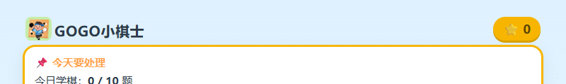
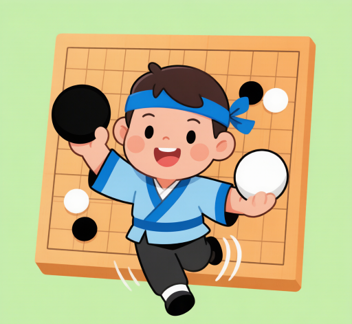

# 用 WorkBuddy 为 8 岁孩子搭建围棋启蒙工作台 GOGO小棋士

## 场景描述

家里有一个 8 岁、刚开始接触围棋的孩子。市面上围棋 App 要么广告多、要么功能太重，孩子很难独立完成"每天做几道题、攒积分、换奖励"这样一个完整的练习闭环。家长希望能有一个轻量、可控、孩子打开就能用、还能自己设奖励和游戏的小工具。

原来的处理方式是用纸质题册，但题目做完没法自动判分、没法攒星星、孩子也没成就感。需要一个能在浏览器里直接跑、单文件就能部署、家长能管理的小应用。

## 想要完成的任务

为 8 岁孩子做一个围棋启蒙工作台，要求：

1. 每天提供 10 道围棋死活/手筋题（基于真实题库）。
2. 左键轮流下黑棋白棋，做到两眼活棋或被吃即判定。
3. 有对战、闯关模式，增加趣味。
4. 积分体系：做题/闯关/对战得星星，勋章阶梯，星星可兑换奖励。
5. 小游戏频道：用星星兑换才能玩，每玩一局都要花星星。
6. 家长专区：PIN 密码保护，能改奖励、增删游戏、加星星、改密码、备份/清空数据。
7. 有专属图标和背景音乐。
8. 单文件 HTML，一键部署上线，桌面放快捷方式。

最终交付物是一个可直接访问的线上应用 + 本地单文件 HTML。

## 使用的 Skill

| Skill | 用途 | 来源或安装方式 |
| --- | --- | --- |
| CloudStudio 部署 | 把本地 `_deploy/` 目录发布为可访问的线上站点，每次迭代后重新部署 | WorkBuddy 内置 skill：cloudstudio-deploy |
| 图像生成 | 生成 GOGO小棋士 的专属卡通图标（小棋士形象） | WorkBuddy 内置工具：ImageGen |
| 浏览器自动化验证 | 用真实 Chrome 跑全流程测试，确保积分扣费、家长 PIN、游戏增删等功能零报错 | Node puppeteer-core + 系统 Chrome |

## 前置条件

- WorkBuddy 版本：支持文件读写、Bash/PowerShell、CloudStudio 部署、ImageGen 工具。
- 操作系统：Windows（也适用 macOS/Linux，浏览器测试需对应平台的 Chrome）。
- 所需账号或权限：WorkBuddy 账号；部署不需要额外账号（CloudStudio sandbox 由 WorkBuddy 提供）。
- 所需输入文件：一个已有的围棋题库 JSON（本案例基于 225 道真实题：石仓一宏死活 123 + 小林光一手筋 102）。
- 系统 Chrome 或 Edge 可执行文件路径（用于真实浏览器测试）。

## 在 WorkBuddy 中的操作

整个过程是持续多轮的迭代开发，每一轮都遵循"改代码 → 读盘确认 → 全文件扫描同类问题 → 语法检查 → 真实浏览器测试 → 同步部署副本 → 发布 → 更新记忆"的纪律。

1. **从练习题引擎起步**：基于已有的"两眼活棋"游戏引擎（含 225 道题），先调整练习题交互——左键轮流下黑白棋，做到关键手即软过关，加"下一题"按钮。
2. **搭工作台骨架**：新建独立单文件 HTML，复用引擎，分 5 个 Tab：今日（每天 10 题）/ 对战 / 闯关 / 积分 / 家长。
3. **积分与勋章**：做题 +10⭐、自由练习 +5⭐、闯关 +20⭐、对战 +10⭐；勋章阶梯 30/60/120/200/350/500⭐。
4. **兑换奖励**：积分页加固定兑换奖励 + 兑换历史，纳入备份/清空。
5. **部署上线**：复制到 `_deploy/index.html`，用 CloudStudio 部署 skill 发布，生成可访问链接。
6. **家长专区**：把奖励 +1000、导出/导入/清空收进 PIN 保护的家长区；加学习统计；加修改密码。
7. **奖励可配置**：家长能增删兑换奖励，实时同步到孩子积分页。
8. **小游戏频道**：新增 🎮 游戏 Tab，3 个围棋主题小游戏（拍白子/接棋子/点气），用星星解锁。
9. **家长增删游戏**：游戏定义也改成家长可配置（名称/图标/星星价/玩法）。
10. **小游戏改按局付费**：取消永久解锁，每玩一局都要花星星，关闭后需重新兑换。
11. **改名 + 图标**：改名为 GOGO小棋士；用 ImageGen 生成卡通小棋士图标，裁掉水印、缩多尺寸，嵌入 HTML 作 logo 和 favicon；桌面快捷方式配专属 ico 图标。
12. **背景音乐**：加肖斯塔科维奇《第二圆舞曲》，默认开，header 有音乐开关按钮。

## 提示词或任务指令

每一轮迭代用户给出的核心指令（节选，按时间顺序）：

```text
把这个围棋练习，为8岁孩子做一个围棋启蒙工作台，每天学10个题，有练习、对战和闯关积分奖励。

部署到线上。

围棋启蒙小屋，删除奖励和家长系统，换成固定的奖励积分模式。

在桌面放一个快捷方式。

增加兑换功能。

家长区增加设置奖励功能。

增加一个可以用积分兑换小游戏的频道。

在家长里面可以增加或删除游戏。

游戏背景设定为黑底白子，比较显眼。

必须用积分兑换小游戏兑换后需要再用积分兑换才能继续玩。

首先改名为 GOGO小棋士。然后帮我做一个合适的图片作为图标。

放一个快捷方式在我的桌面。

增加背景音乐，选斯塔科夫维奇的the second waltz。

音乐默认是开。
```

WorkBuddy 在每一条指令后，自主完成代码改动、测试、部署、记忆更新，并在交付时给出"改了什么 / 怎么用 / 验证情况 / 分享链接"四段式说明。

## 在 WorkBuddy 中的效果

最终交付了一个完整可用的线上应用，核心界面如下：



应用含 6 个频道：今日练习、对战、闯关、⭐积分、🎮游戏、👨‍👩‍👧家长。专属图标是戴蓝色头带、举黑白棋子的小棋士卡通形象：



关键能力：
- 每日 10 题，做完软过关，左键轮流下黑白。
- 积分体系完整：做题/闯关/对战得星 → 勋章 → 兑换家长自定义奖励。
- 小游戏按局付费（每玩一局扣星，无永久解锁）。
- 家长专区 PIN 保护：统计、加星、改奖励、增删游戏、改密码、数据备份/清空。
- 专属图标 + favicon + 桌面快捷方式图标。
- 背景音乐《第二圆舞曲》默认播放，可开关。

## 验收标准

- 线上链接可访问，HTTP 200，页面标题为"GOGO小棋士 · 8岁小朋友的围棋工作台"。
- 头部显示图标 + "GOGO小棋士"文字，浏览器标签页 favicon 为专属图标。
- 今日练习能正常下棋、判定、过关、加分。
- 积分页勋章阶梯和兑换奖励正常，兑换扣星、记录历史。
- 小游戏频道：每玩一局扣对应星星（如 500→480→460），关闭后需重新兑换；星星不足时按钮置灰。
- 家长专区：未设密码只显示设置密码；设密码后进入；改密码需验旧密码；退出后需重输；错密码被拒。
- 家长增删奖励/游戏后，孩子对应频道实时同步。
- 背景音乐默认尝试播放，被浏览器阻止时首次点击页面即播放；开关按钮状态正确。
- 真实 Chrome 全流程测试零运行时错误。

以上标准均通过 puppeteer 真实浏览器测试逐项验证。

## 遇到的问题

- **CloudStudio 旧链接失效**：重新部署后 `app.workbuddy.link` 域名 404，改用 `bj8.agentos-app.net` 域名并更新桌面快捷方式。
- **小游戏永久解锁模型不符合预期**：第一版做成"花星解锁后永久免费玩"，用户要求改成"每玩一局都要花星"，于是删除解锁存储逻辑，改为按局扣费。
- **图标水印**：ImageGen 生成的图带"AI生成 WORKBUDDY>"水印，用 puppeteer + canvas 裁掉底部 8% 后再缩多尺寸。
- **ico 文件路径写坏**：bash 的 printf 对反斜杠转义处理有问题，把 `.url` 文件里的路径写成了 `//`，改用 Node 脚本写文件（CRLF）解决。
- **ffmpeg 压缩失败**：安装的 ffmpeg-static 因 EBUSY/EFTYPE 无法执行，背景音乐直接用原 3.7MB MP3 作为独立文件随部署上传。
- **浏览器自动播放限制**：音乐无法真正"默认开"，采用"页面加载即尝试播放 + 首次点击页面任意位置即播放"的折中方案。
- **git clone 证书吊销检查失败**：Windows git 默认用 schannel 做 TLS，证书吊销检查（CRL/OCSP）失败导致 clone 报 `CRYPT_E_NO_REVOCATION_CHECK`，改用 `http.sslBackend=openssl` + `GIT_SSL_NO_VERIFY=1` 后 clone 成功。

## 安全与限制

- 应用数据全部存在浏览器本地 localStorage（前缀 `wb_go_kids_`），不上传服务器；换设备/清缓存数据会丢失，家长区有导出/导入备份功能。
- 家长 PIN 存在本机浏览器，换设备需重新设置；忘记密码只能清 localStorage 重置（会丢积分数据）。
- 背景音乐 MP3 来自第三方网站（Cantemus 合唱团）的木管五重奏改编版，肖斯塔科维奇作品在多数地区仍受版权保护，本应用仅用于家庭私人学习场景，不做商业分发。
- 小游戏的"奖励 +1000"和"清空数据"等敏感操作已收进 PIN 保护的家长专区，孩子无法直接操作。
- 部署的应用是公开链接（知道 URL 即可访问），但无敏感数据；如需限制访问应在 CloudStudio 侧配置。

## 可以怎样复用

这套"单文件 HTML + 多 Tab + localStorage + CloudStudio 部署"的模式可以直接迁移到其他儿童启蒙场景，例如：

- **换主题**：把围棋题库换成数学口算、英语单词、古诗背诵，引擎和积分/奖励/家长体系几乎不用改。
- **换游戏**：小游戏的三种玩法（拍白子/接棋子/点气）可以替换成对应主题的小游戏。
- **换图标和音乐**：用 ImageGen 生成新主题的卡通图标，换一首背景音乐即可。
- **家长可配置思想**：奖励、游戏定义都做成家长可增删的 localStorage 数据，这个模式适合任何需要"家长管理 + 孩子使用"的应用。

复用时核心提示词模板：

```text
为 [年龄段] 孩子做一个 [主题] 启蒙工作台，每天学 10 个 [题目类型]，有练习、对战和闯关积分奖励。
积分可以兑换奖励和小游戏。家长专区用密码保护，能改奖励、增删游戏、加积分、备份清空数据。
单文件 HTML，部署上线，桌面放快捷方式。有专属图标和背景音乐。
```

WorkBuddy 会按这个模板自主完成从开发到部署的全流程，并保持迭代可扩展。
