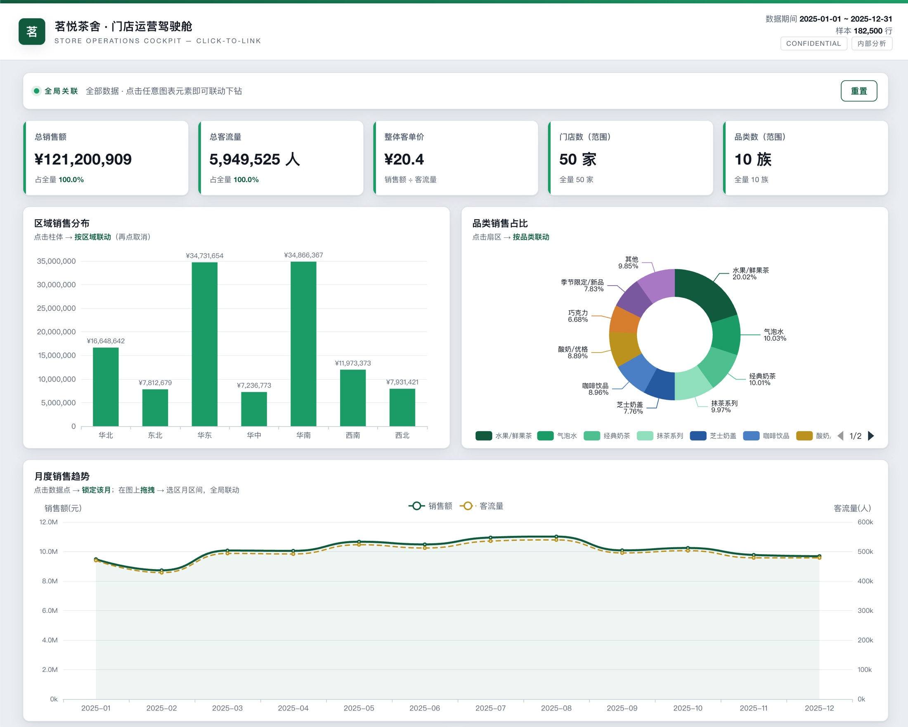
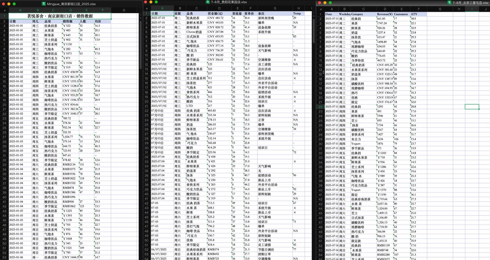
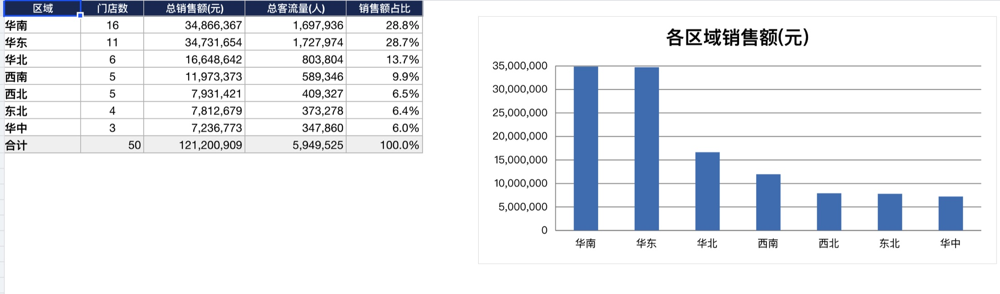
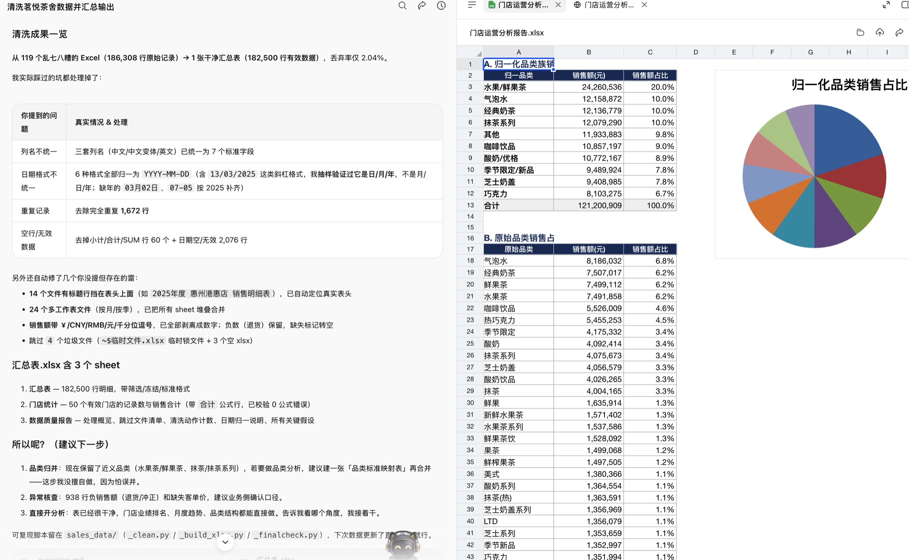

# 用 WorkBuddy 清洗 119 份门店 Excel 并生成可交互运营看板



## 场景描述

茶饮连锁品牌「茗悦茶舍」（教学用模拟数据）在全国有约 50 家门店，各门店自行用 Excel 记录每日销售明细并汇总到总部。实际收到的 119 个 `.xlsx` 文件问题非常典型：

- **列名三套体系并存**：中文（日期/品项/销售额）、中文变体（星期/品类/营业额(元)/客流量）、英文（Date/Category/Revenue(¥)/Customers/ATV）
- **结构不一致**：14 个文件带大标题行（真实表头在第 2 行），24 个文件按「月」或「季」拆成多个 Sheet
- **日期格式 6 种**：`2025-01-01`、`2025/01/01`、`2025.01.01`、`03/03/2025`（日/月/年）、`03月02日`（缺年）、`07-05`（缺年月日）
- **金额字段有噪声**：混入 ￥/CNY/RMB/元、千分位逗号，还有「待补录」「--」等缺失标记和负数退货
- **同一门店分散在多个文件**：例如北京三里屯店的数据散落在 6 个文件里



手工合并和清洗这类数据通常需要 6-7 小时，且容易出错。这个案例演示如何把工作一次性交给 WorkBuddy，并拿到可以直接汇报的交付物。

## 想要完成的任务

输入：`sales_data/` 目录下 119 个格式混乱的门店销售 Excel。

目标和交付物：

1. 把所有门店数据合并、清洗成一张干净的汇总表（格式统一、去重、口径明确）
2. 生成一份多 Sheet 的 Excel 运营分析报告：区域汇总、城市汇总、TOP10 门店、品类占比、月度趋势
3. 生成一个可离线打开的交互式 HTML 看板：点击任意图表维度即全局联动重算（「驾驶舱」式体验）

## 使用的 Skill

| Skill | 用途 | 来源或安装方式 |
| --- | --- | --- |
| xlsx | 读取/写入 Excel、生成带图表和活公式的分析报告、公式重算校验（recalc） | WorkBuddy 内置 |

其余工作（文件遍历、Python 数据清洗、HTML/ECharts 看板生成）由 WorkBuddy 的通用文件读写和代码执行能力完成，无需额外安装 Skill。

## 前置条件

- WorkBuddy 可正常使用，能读写本地文件
- WorkBuddy 自带的 Python 环境（pandas + openpyxl，由 WorkBuddy 自动管理，无需手工安装）
- 输入文件：门店销售 Excel 放在一个目录下（本案例为 119 个 `.xlsx`）
- 不需要任何外部账号或 API Key

## 在 WorkBuddy 中的操作

1. **摸底**：让 WorkBuddy 先扫描目录，报告文件数量、格式差异和脏数据类型，先出方案再动手。
2. **清洗合并**：确认方案后，WorkBuddy 编写并运行清洗脚本，输出 `cleaned_data/汇总表.xlsx`（汇总表 / 门店统计 / 数据质量报告 三个 Sheet），同时保留可复现脚本。
3. **生成 Excel 分析报告**：基于汇总表生成 8 个 Sheet 的 `门店运营分析报告.xlsx`，占比、合计、客单价、环比全部用 Excel 活公式（源数据更新即重算），并用 recalc 校验 0 公式错误。
4. **生成 HTML 看板**：要求「可点击维度联动、咨询所交付物风格」，WorkBuddy 用 ECharts（下载到本地、离线可用）生成 `门店运营分析看板.html`。
5. **升级为驾驶舱**：追加一句指令，把筛选面板改成「点到哪关联到哪」的全局联动，趋势图支持拖拽选月区间（复用时可直接用下文优化版第三轮提示词，一步提清这些要求）。

每一步 WorkBuddy 都会汇报它发现了什么、做了什么假设，人只需要在关键节点确认口径。

## 提示词或任务指令

实际执行共三轮对话。第一轮提示词为当时原文；第二、三轮在原文基础上做了优化（见每轮后的说明），复用时可直接采用优化版。

第一轮（清洗合并，原文）：

```text
我有一个名为"茗悦茶舍"的茶饮品牌，我的目标是你需要帮我做一次数据清洗,把所有的数据清洗干净之后，帮我输出到`cleaned_data/汇总表.xlsx`目前我的数据可能存在以下问题一个或者多个或者更多的问题：
1. 日期格式不统一
2. 列名不统一
3. 可能有重复记录
4. 可能有空行或无效数据
帮我：
1. 读取所有文件
2. 统一日期格式
3. 统一列名
4. 去除重复记录和无效数据
5. 合并成一张干净的汇总表
```

第二轮（生成分析报告，优化版）：

```text
基于刚才清洗好的汇总表，生成一份用于门店运营分析和推广策略的Excel报告，
保存为 analysis/门店运营分析报告.xlsx，每个分析一张Sheet，至少包括：

1. 按区域汇总：七大地理分区销售额排名与占比（含柱状图）
2. 按城市汇总：城市销售额排名（含条形图）
3. 找出销售额TOP10的门店（含客单价与占比，含条形图）
4. 分析各品类的销售占比（含饼图）
5. 生成月度趋势分析：全年12个月销售额与客流量（双轴折线图）+ 环比

要求：所有占比、合计、客单价、环比用Excel活公式实现，源数据更新能自动重算；
最后加一张「洞察与建议」Sheet，基于数据给出可操作的运营和推广建议。
```

优化点：明确了**输出文件和格式**（Excel、每项分析一张 Sheet、配图）、补上了**活公式**要求（源数据更新后报告自动重算），并把「做策略」的意图落成一张具体的「洞察与建议」Sheet——原指令只说"做一个报告"，交付形态全靠模型猜。

第三轮（交互看板，优化版）：

```text
基于汇总表，用合适的可交互库（如ECharts）生成一个HTML看板。它不只是静态报告，
我可以随便点击一些维度，页面内容随之更新。具体要求：

1. 点击任意图表的柱体/扇区，就把该维度设为当前筛选，所有KPI、图表、明细表实时联动重算
2. 月度趋势图支持拖拽选择月份区间
3. 被点击的维度图保持完整显示（仅高亮选中项），其余维度收窄，避免"点完只剩一根柱"
4. 顶部提供全局状态条，可逐维取消筛选、一键重置
5. 依赖库下载到本地，双击即可离线打开
6. 视觉风格请仔细设计，要专业，像德勤这样的咨询机构输出的交付物
```

优化点：把"随便点一些维度"翻译成**明确的交互规则**（点击即筛选、全局联动、拖拽选月、保留上下文、可重置），并补上**离线可用**的硬性要求——避免生成的 HTML 依赖在线 CDN，断网或分享后打不开。"像德勤"的风格描述保留原文，模型能听懂，但交互行为必须写清楚。

## 在 WorkBuddy 中的效果

**清洗结果**：原始 186,308 行 → 有效 182,500 行（丢弃率 2.04%）。去除小计/合计行 60 条、无效日期 2,076 行、完全重复记录 1,672 行；53 个门店名被识别（50 个有有效数据），跨文件同名门店自动合并。所有口径假设写入了「数据质量报告」Sheet。

**Excel 分析报告**：8 个 Sheet（封面指标卡 / 区域汇总 / 城市汇总 / TOP10 门店 / 品类占比 / 月度趋势 / 洞察与策略建议 / 数据说明与假设），165 个活公式，recalc 校验 0 错误。核心发现：华南（28.8%）与华东（28.7%）双龙头合计过半；TOP10 门店占全盘 38.7%；水果/鲜果茶品类占 20.0%。



**HTML 驾驶舱**：深绿品牌色 + 金点缀的咨询所风格，KPI 卡、5 张图表、门店明细表全部全局联动；趋势图支持拖拽选月。聚合数值经 node 脚本多场景模拟校验，与 Excel 报告完全一致。


**执行过程**：WorkBuddy 接到任务指令后开始执行（左图）；清洗完成后，它会先汇报发现了哪些脏数据问题、做了哪些处理假设，由人确认口径后再继续（右图）。




## 验收标准

- 清洗后汇总表的行数、门店数与源文件能对上（有效 182,500 行 / 50 门店，丢弃明细可追溯）
- 「数据质量报告」Sheet 明确列出每项处理假设（缺年日期默认 2025、负销售按净额计入等）
- Excel 报告用 recalc 重算校验：0 公式错误
- HTML 看板的聚合数字（总额、区域、TOP 店、品类、月度）与 Excel 报告逐一吻合
- 看板文件双击离线可打开，联动逻辑经多场景模拟验证（单区域 / 区域+城市 / 品类 / 单月）

## 遇到的问题

- **日期格式歧义**：`03/03/2025` 这类格式无法直接判断是日/月/年还是月/日/年。WorkBuddy 通过抽样验证（同一文件内出现 `15/03/2025` 这类日期）确认为 day-first 后才批量解析。
- **缺年份的日期**：`03月02日` 这类记录缺少年份，WorkBuddy 没有自行猜测，而是提出假设（所有源文件均为 2025 年度，默认补 2025）并写入数据质量报告，由人确认。
- **品类近义词**：「水果茶」和「鲜果茶」是否算同一类？清洗阶段只去空格、不主观合并；归一规则放在分析阶段，原始 53 个品类明细完整保留在报告中供核对。
- **看板交互陷阱**：初版交叉筛选会出现「点完只剩一根柱」的问题——被点维度自身也被收窄。改造为被点维度图忽略自身筛选、始终完整显示并高亮选中项。

## 安全与限制

- 本案例使用的是**教学模拟数据**（品牌与门店均为虚构），可公开；真实业务数据请勿在公开案例中原样贴出，截图需脱敏。
- 整个流程只读写本地目录，不访问外部网络、不需要账号授权。
- WorkBuddy 会在数据目录下生成中间产物（清洗脚本、中间 CSV、质量 JSON），提交或归档前注意区分交付物和过程文件。
- 清洗脚本会跳过 Excel 临时锁文件（`~$` 开头）和空文件，执行前建议关闭正在编辑的 Excel。

## 可以怎样复用

- **任何多 Excel 合并场景**：连锁零售、经销商月报、分公司报销、问卷分卷回收——只要「多人各填各的表、格式对不上」，提示词框架照搬即可。
- **先摸底再动手**：第一步要求 WorkBuddy 先扫描汇报问题再执行，这个习惯对一切数据任务都适用，能避免口径被默默猜错。
- **活公式交付**：要求分析报告用活公式而非写死数值，后续月份数据追加后报告自动更新。
- **静态报告 → 交互看板**：先拿 Excel 报告确认数字口径，再追加一句指令生成 HTML 看板，是低成本升级汇报体验的路径。
