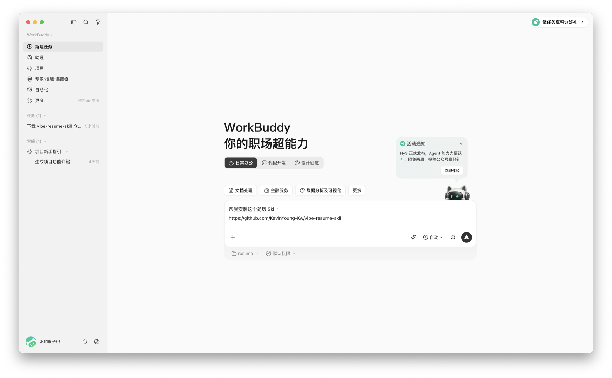
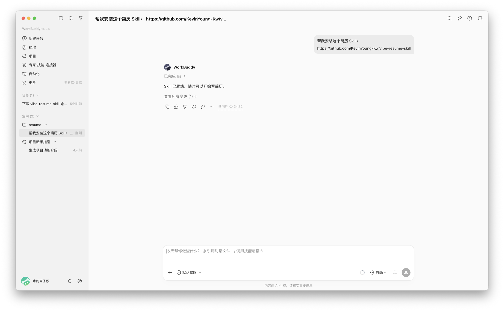
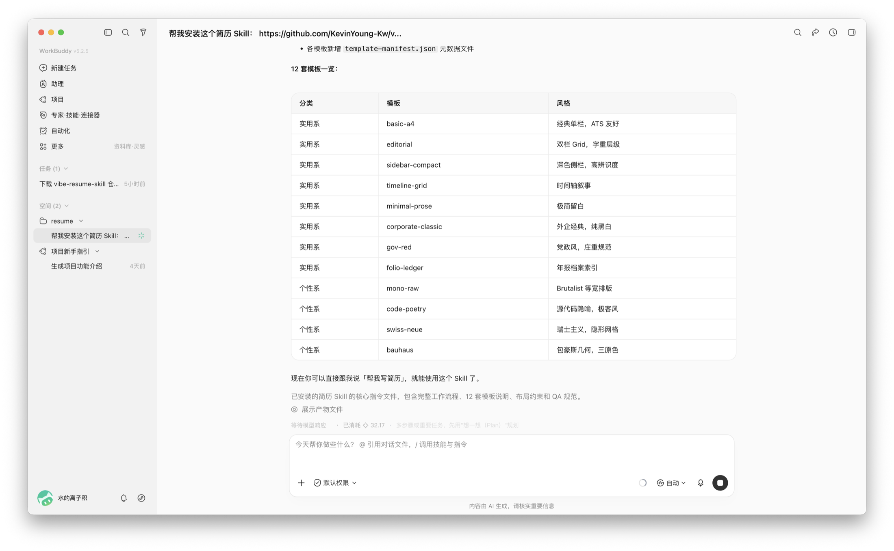
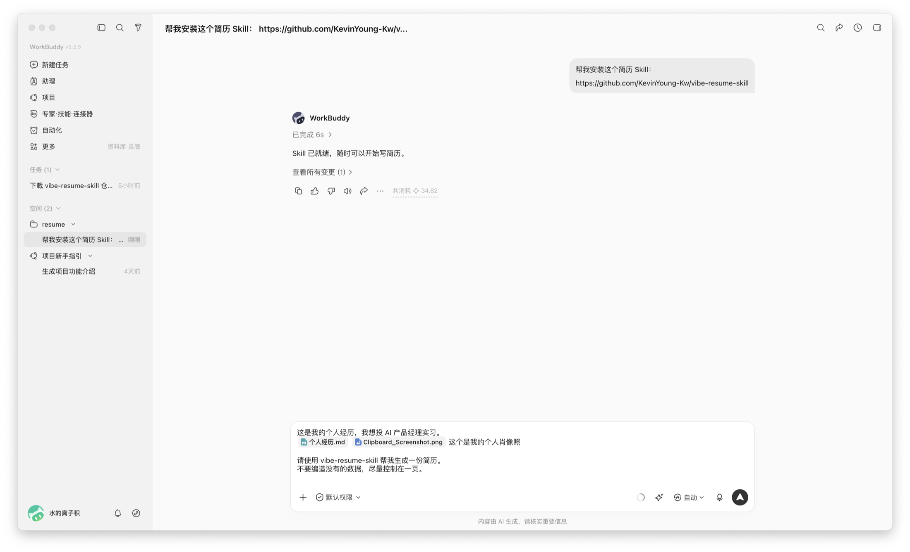
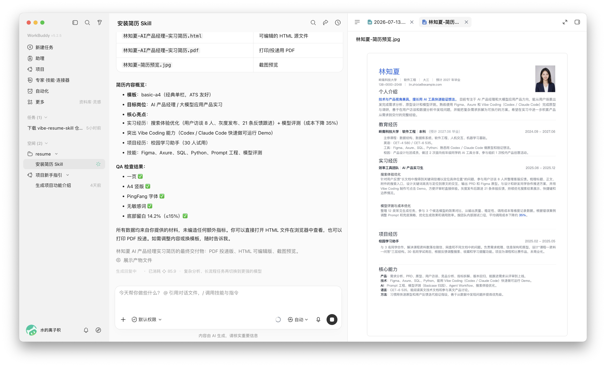
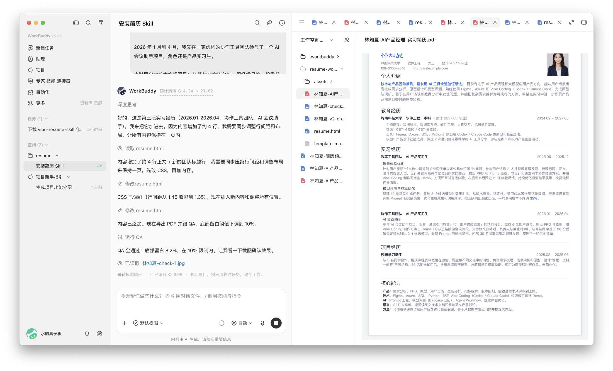

# 别再手调排版了，用 WorkBuddy 生成一份好看的简历

## 场景描述

去年秋招时，我用 PPT 手抠过一份简历。效果确实不错，但它有一个很现实的问题：只要多加一段经历，原本对齐的内容就会被挤乱，字号、行距和分页又得重新调一遍。

后来我把这套简历做成了 HTML，又整理成开源的 [Vibe Resume Skill](https://github.com/KevinYoung-Kw/vibe-resume-skill)。它想做的事情很简单：**让 AI 直接生成一份好看的简历，把时间留给经历本身，而不是字号、间距和分页。**

这次我在 WorkBuddy 里重新跑了一遍。从发出第一段经历，到后来再补进一段实习，简历也一点点变得更饱满。

为了方便公开展示，截图里的候选人、联系方式、团队和项目数据都是虚构的，证件照也由 AI 生成。

## 想要完成的任务

**用 WorkBuddy 生成一份精美、能直接投递的简历。**

这个 Skill 的使用方式很简单。你只需要在对话中提到它，并说明想做什么。比如，把自己的经历粘贴进聊天框，再拖入一张照片，一句话就可以开始生成简历。后续编辑也一样：哪里太空、哪里太挤，或者又想补哪段经历，直接告诉 AI，让它继续修改即可。

## 使用的 Skill

| Skill | 用来做什么 | 怎么安装 |
| --- | --- | --- |
| Vibe Resume Skill | 生成和更新简历，自动处理模板、排版和导出检查 | 把 [GitHub 仓库地址](https://github.com/KevinYoung-Kw/vibe-resume-skill) 发给 WorkBuddy |

## 前置条件

准备好两样东西就可以开始：一段真实的个人经历，以及一张想放进简历的照片。

没有现成文案也没关系，可以先把自己做过的事情直接讲给 WorkBuddy；已经有旧简历的话，也可以把旧简历发进来，让它在原版上继续改。

## 在 WorkBuddy 中的操作

### 第一步，把 Skill 发给 WorkBuddy

打开一个新任务，直接发送：

```text
帮我安装这个简历 Skill：
https://github.com/KevinYoung-Kw/vibe-resume-skill
```



安装完成后，WorkBuddy 会直接告诉你可以开始写简历了。



Skill 里现在有 12 套 A4 模板。它们不只是换个颜色，而是有不同的结构、字号层级和阅读节奏。没有特别偏好时可以直接用默认款，也可以让 WorkBuddy 先把模板列出来再选。



### 第二步，直接把经历和照片发进去

接下来，我把个人经历粘贴进去，附上一张照片，然后说：

```text
这是我的个人经历，我想投 AI 产品经理实习。

请使用 vibe-resume-skill 帮我生成一份简历。
不要编造没有的数据，尽量控制在一页。
```



WorkBuddy 用默认模板生成了第一版，右边可以直接看到完整简历。HTML、PDF 和预览图也一起准备好了。



### 第三步，不满意就继续说

第一版已经能看，但段落之间有点松。我没有自己去找 CSS，只说：

```text
段落与段落之间有些稀疏，帮我适当收紧一点，不要删内容。
```

后来我又多了一段经历，就把新内容继续贴进去：

```text
这是我最近新增的一段经历，帮我加到已有简历里。
不要删掉原来的内容，仍然尽量保持一页。
```

WorkBuddy 直接在原来的简历上继续改。新经历加进去了，旧内容也还在，整页没有被挤成密密麻麻的一团。



## 最终效果

最后这份简历比第一版明显更饱满，但仍然保持一页。底部留白从 `14.2%` 调整到 `8.2%`，没有文字溢出，彩色证件照也正常保留。

我最喜欢的其实不是“一句话生成”，而是它能陪着我一直改。今天补一段实习，明天换一个岗位，或者拿到新 JD 想单独出一版，都可以继续在对话里完成，不用再重新手调一遍排版。

## 验收标准

我最后主要看这几件事：

- 第一眼确实像一份认真设计过的简历，而不是 Word 默认样式。
- PDF 只有一页，文字没有压线、重叠或被裁掉。
- 新经历放在正确的位置，原来的内容没有莫名其妙消失。
- 姓名、日期和数据都来自我提供的材料，没有为了“好看”而瞎编。
- HTML 还能继续改，PDF 可以正常打开和投递。

## 遇到的问题

第一版不是最理想的版本。它虽然已经是一页，但段落有些松，内容看起来还不够饱满。新增经历以后，另一个风险又变成了“为了塞下一页而把所有字缩得很小”。

实际用下来，最有效的方式就是把感受直接说出来，比如“这里太空了”“这两段太挤”“这段经历不能删”。WorkBuddy 会继续调整，但最后还是要自己从头到尾读一遍，确认表达和阅读顺序都没问题。

## 安全与限制

- 简历里通常有姓名、电话、邮箱和照片。公开截图前一定要脱敏；这个 Case 使用的全部是虚构材料。
- Skill 可以帮忙整理和改写，但经历是否真实、数字能不能公开，最终仍然由本人负责。
- 内容太多时，不要只靠缩小字号硬塞。更好的做法是删掉重复表述，或者针对不同岗位分别出版本。

## 可以怎样复用

这套流程最适合三种情况：

1. **从零写一份简历**：把自己的经历直接贴进去，生成第一版。
2. **更新已有简历**：把旧简历和新增经历一起发过去，让它保留原来的风格继续改。
3. **针对 JD 出新版本**：把简历和岗位描述一起发送，事实不变，只调整经历顺序、关键词和篇幅侧重。

不用背固定指令。把经历、目标岗位和不能乱改的事实说清楚，后面就像正常聊天一样修改即可。

## 找到我

我是水的离子积，也是 Vibe Resume Skill 的作者。使用时遇到问题、想交流简历模板，或者有新的点子，都可以来找我。

- GitHub：[KevinYoung-Kw](https://github.com/KevinYoung-Kw)
- 公众号：**水的实践说**

<div class="vibe-resume-contact">
  <figure class="vibe-resume-contact__wechat">
    
    <figcaption>个人微信 · 水的离子积</figcaption>
  </figure>
  <figure class="vibe-resume-contact__account">
    
    <figcaption>微信搜一搜 · 水的实践说</figcaption>
  </figure>
</div>

<style>
.vibe-resume-contact {
  display: flex;
  gap: 24px;
  align-items: center;
  margin-top: 24px;
}

.vibe-resume-contact figure {
  margin: 0;
  text-align: center;
}

.vibe-resume-contact img {
  display: block;
  width: 100%;
  margin: 0 auto 8px;
}

.vibe-resume-contact__wechat {
  flex: 0 0 210px;
}

.vibe-resume-contact__account {
  flex: 1;
}

.vibe-resume-contact figcaption {
  color: var(--vp-c-text-2);
  font-size: 13px;
}

@media (max-width: 720px) {
  .vibe-resume-contact {
    flex-direction: column;
    align-items: stretch;
  }

  .vibe-resume-contact__wechat {
    flex-basis: auto;
    width: min(100%, 260px);
    margin: 0 auto !important;
  }
}
</style>
