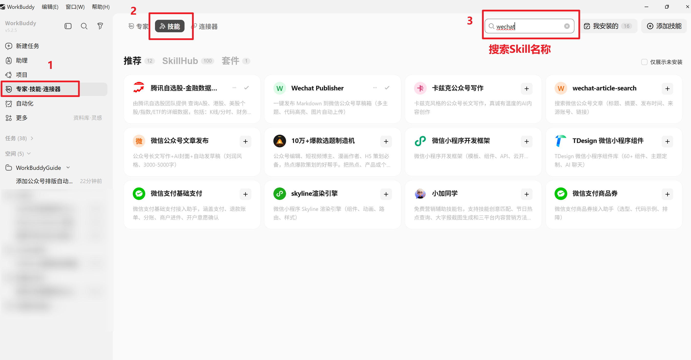

# 用 WorkBuddy 公众号 Skill 一键排版并发布到微信公众号草稿箱

## 场景描述

写公众号文章，最耗时的往往不是内容本身，而是排版。在微信后台编辑器里调整字号、行距、缩进、图片位置，经常要反复预览和修改。整篇文章从写完后到真正能发布，排版时间可能和写作时间一样长。用 WorkBuddy 把这件事变成两步：用 Markdown 写好内容，剩下的排版和发布交给 Skill 自动完成。

我自己平时写公众号最大的问题就是排版，真的对排版深恶痛绝，尤其是图片外链的处理。之前我的公众号排版流程是这样的：markdown写好内容->第三方编辑器美化->粘贴到微信公众号草稿中（最大的问题就在这，我的文章中会放很多图片，但是从编辑器中粘贴过来的图片经常挂掉，因为公众号不支持第三方图床）->逐一粘贴图片->预览、修改->发布。

而现在有了Wechat Publisher可以一键排版，自动上传图片到公众号草稿箱，真的是节省了我半个多小时的时间。

## 想要完成的任务

完成后，WorkBuddy 应当能够：

1. 读取一篇 Markdown 格式的文章（标题、正文、图片、代码块）。
2. 自动将 Markdown 转换为微信公众号兼容的排版格式，包括代码高亮、主题样式和 Mac 风格代码块。
3. 自动将文章中的本地图片和网络图片上传至微信图床。
4. 一键将排版后的文章推送到公众号草稿箱。
5. 在公众号后台预览或微调后即可群发。

## 使用的 Skill

| Skill            | 用途                                              | 来源或安装方式                   |
| ---------------- | ------------------------------------------------- | -------------------------------- |
| wechat-publisher | Markdown 转公众号排版，一键上传图片并推送到草稿箱 | WorkBuddy 内置推荐市场，直接安装 |

wechat-publisher 基于开源项目 [wenyan-cli](https://github.com/caol64/wenyan-cli)，内置多套排版主题和代码高亮方案，支持自动图片上传和草稿箱推送。

## 前置条件

- WorkBuddy 可以正常使用。
- 已经拥有微信公众号（订阅号或服务号），并具备开发者权限。
- **已获取微信公众号的 AppID 和 AppSecret（在公众号后台「设置 → 开发 → 基本配置」中查看）**。
- 本机公网 IP 已添加到公众号后台的 IP 白名单中（最好用WiFi而非手机热点，因为热点IP每次都会变，那么每次就要重复添加白名单IP）。
- 有一篇用 Markdown 写好的文章（含标题和封面图）。

## 在 WorkBuddy 中的操作

### 第一步：安装 wechat-publisher Skill

在 WorkBuddy 中新建任务，输入：

```text
帮我安装公众号排版 Skill：wechat-publisher
**或者直接去技能搜索框搜索：wechat-publisher** 这个简单直接
```

WorkBuddy 会从推荐市场中搜索并安装这个 Skill。安装完成后，可以确认一下 Skill 是否就位：

```text
wechat-publisher Skill 已经安装好了吗？告诉我它能做什么。
```


### 第二步：配置公众号凭证

wechat-publisher 需要公众号的 AppID 和 AppSecret 才能调用微信 API。推荐使用 wenyan 自带的凭证管理工具进行配置，凭证会持久化保存到本地配置文件：

```text
帮我执行 wenyan credential -s，我需要配置公众号的 AppID 和 AppSecret。
```

WorkBuddy 会引导你逐步输入 AppID 和 AppSecret，配置完成后对话框确认查看凭证文件是否已经保存成功。


> **注意**：在配置凭证之前，务必先登录公众号后台（设置 → 开发 → 基本配置 → IP 白名单），将本机的公网 IP 添加到白名单中。可以用 `curl ifconfig.me` 查看当前公网 IP。

### 第三步：准备 Markdown 文章

文章的 Markdown 文件需要包含 frontmatter，至少要有 `title`（标题）和 `cover`（封面图路径）。封面图可以是本地文件或网络 URL。

```markdown
---
title: 我的技术文章
cover: ./assets/cover.jpg
---

# 正文开始

这是文章内容...
```

可以直接在 WorkBuddy 中让 AI 帮你写好文章，也可以把自己写好的 Markdown 文件拖进对话。如果还没有封面图，还可以让 WorkBuddy 帮你生成一张：

```text
帮我生成一张适用于公众号技术文章封面的图片，主题是关于 AI 辅助写作的。
```


### 第四步：执行排版与发布

文章准备好后，告诉 WorkBuddy 执行发布：

```text
使用 wechat-publisher Skill，把这篇文章发布到公众号草稿箱。

要求：
- 使用 lapis 主题
- 代码高亮用 solarized-light
- 启用 Mac 风格代码块
- AppID 用我之前配置的那个
```

WorkBuddy 会自动完成以下步骤：

1. 检查 Markdown 文件的 frontmatter 是否完整
2. 将文章中的图片上传到微信图床
3. 应用所选主题和代码高亮样式进行排版转换
4. 调用微信 API 将排版后的文章推送到草稿箱


### 第五步：在公众号后台预览与群发

发布到草稿箱后，登录微信公众号后台，在「内容管理 → 草稿箱」中就能看到排版好的文章。在后台预览确认无误后，即可群发。


## 提示词或任务指令

下面是经过脱敏、可以直接复用的任务指令：

```text
使用 wechat-publisher Skill，把我写好的 Markdown 文章发布到公众号草稿箱。

具体要求：
1. 文章文件路径：D:/articles/my-post.md
2. 使用 lapis 主题和 solarized-light 代码高亮
3. 启用 Mac 风格代码块装饰
4. 文章中的图片（本地路径和网络 URL）全部自动上传到微信图床
5. 发布前确认 frontmatter 包含 title 和 cover
6. AppID 使用我之前通过 wenyan credential -s 配置的那个

发布成功后，告诉我如何到公众号后台预览这篇文章。
```

## 在 WorkBuddy 中的效果

这一套流程走完后，你得到的是：

- 一篇已经排版完成的公众号草稿，不需要在微信后台编辑器中手动调整字号、间距、图片位置。
- 文章中的代码块带有语法高亮和 Mac 风格装饰，比微信原生编辑器效果好得多。
- 所有图片已自动上传到微信图床，不会出现图片丢失或外链失效的问题。
- 在公众号后台稍作预览即可直接群发。

## 验收标准

- wechat-publisher Skill 安装成功，并能在任务中被调用。
- 公众号凭证配置成功，能看到已保存的 AppID。
- Markdown 文章成功推送到公众号草稿箱，后台可以看到排版后的文章。
- 文章中的代码块带有正确的语法高亮和主题样式。
- 文章中的所有图片（包括本地图片和网络图片）都能正常显示。
- 在公众号后台预览时，排版效果与预期一致。

## 常见问题

### 发布时报 "IP 不在白名单"

这是最常见的问题。登录公众号后台，在「设置 → 开发 → 基本配置 → IP 白名单」中添加当前机器的公网 IP。用 `curl ifconfig.me` 可以查看公网 IP。

### 报错 "未能找到文章封面"

检查 Markdown 文件的 frontmatter 中是否包含了 `cover` 字段。wenyan-cli 强制要求 title 和 cover 两个字段缺一不可。封面图路径建议使用绝对路径（Windows 下如 `D:/photos/cover.jpg`）。

### 图片上传失败

确保图片路径正确。如果 Markdown 中的图片使用相对路径，需要在 Markdown 文件所在目录执行发布命令。或者改用绝对路径引用图片。

### 想换一种排版风格

wechat-publisher 支持多种内置主题。可以在发布命令中更换 `-t` 参数，例如：

- `-t lapis`：青金石主题（推荐）
- `-t phycat`：物理猫主题
- `-t default`：默认主题

代码高亮也可以通过 `-h` 参数切换，如 `-h github`、`-h monokai`、`-h dracula` 等。

**当然，这些指令记记不住都没有关系，直接用自然语言描述，告诉AI你想做的事情，它可以帮你切换主题。**

## 安全与限制

- AppID 和 AppSecret 是公众号的核心凭证，不要分享给他人，也不要在公开场合暴露。
- 推荐使用 `wenyan credential -s` 配置凭证（凭证保存在本地加密文件中），避免将密钥写在命令或环境变量里。
- 公众号 IP 白名单建议只添加必要的 IP，并定期检查。
- 文章推送到的是草稿箱而非直接群发，发布前仍需人工审核内容。
- 如果文章包含公司内部或敏感信息，发布前先做脱敏处理。

## 可以怎样复用

这个 Case 的核心能力是「Markdown 写作 + 自动排版发布」。替换文章内容，就能适配不同的公众号创作场景：

- **技术博客**：Markdown 写技术教程，代码块自动高亮，推送到草稿箱审核后群发。
- **团队周报**：用模板和 Markdown 整理周报内容，自动排版后分享到团队公众号。
- **多号管理**：通过 `--app-id` 参数切换不同公众号，一个 Skill 管理多个号的草稿发布。
- **定期专栏**：结合 WorkBuddy 自动化任务，把固定格式的文章模板设为每日或每周重复执行，实现定期更新。
